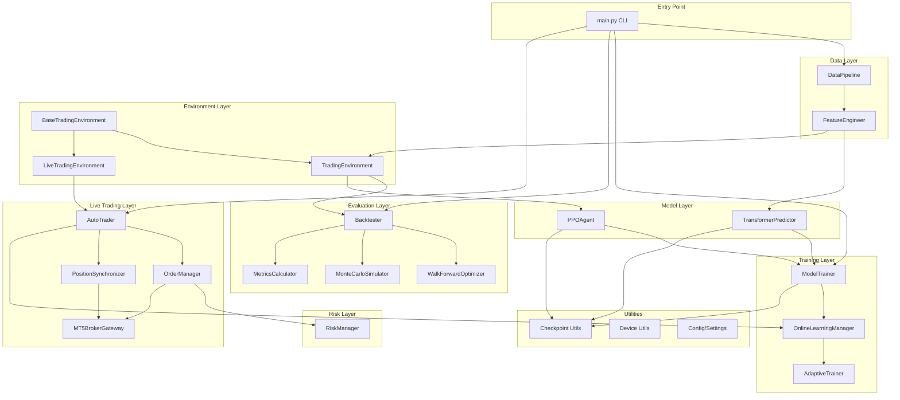
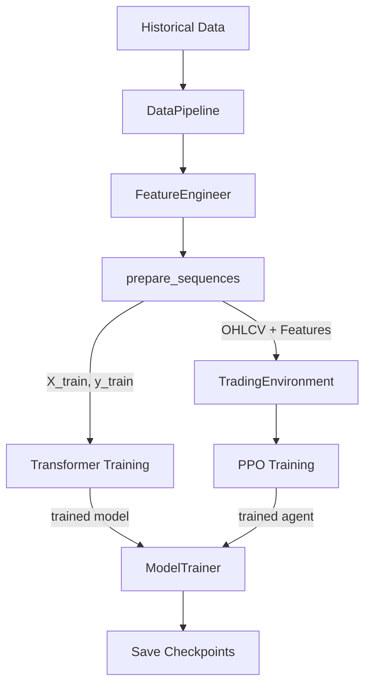
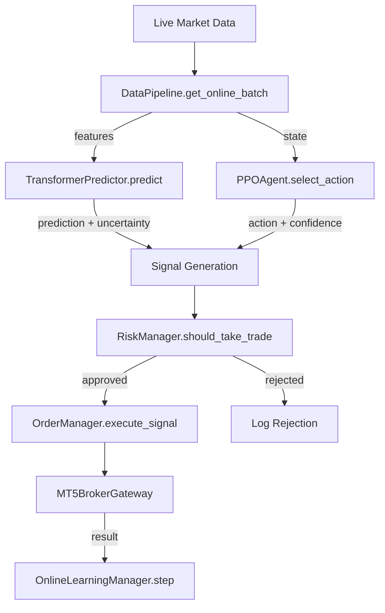

# Leap Trading System - Architecture Documentation

## System Overview

Leap is an AI-powered forex trading system that combines **Temporal Fusion Transformer** for price prediction with **Proximal Policy Optimization (PPO)** reinforcement learning for trading decisions. The system supports:

- **Offline Training**: Historical data for model training with walk-forward validation
- **Online Learning**: Continuous adaptation to changing market regimes
- **Live Trading**: MetaTrader 5 integration with paper mode for safe testing
- **Backtesting**: Realistic simulation with transaction costs and Monte Carlo analysis

### Core Design Principles

1. **Separation of Concerns**: Each module has a single responsibility
2. **Modularity**: Components can be swapped or upgraded independently
3. **Risk-First Design**: Risk management integrated at every layer
4. **Online Adaptation**: Continuous learning from live market feedback
5. **Standardized Interfaces**: Consistent patterns across models and environments

## Component Diagram



## Module Breakdown

### Data Layer

#### DataPipeline (`core/data_pipeline.py`)
Central data management for both training and live trading.

| Method | Purpose |
|--------|---------|
| `connect()` | Connect to MT5 data source |
| `fetch_historical()` | Get OHLCV data for symbol/timeframe |
| `prepare_sequences()` | Create (X, y) sequences for training |
| `get_online_batch()` | Get latest data for live inference |
| `split_data()` | Train/val/test split with temporal ordering |

#### FeatureEngineer (`core/feature_engineer.py`)
Computes 100+ technical indicators and patterns.

```
compute_all_features()
├── _add_price_features()      # Returns, gaps, true range
├── _add_moving_averages()     # SMA, EMA (multiple periods)
├── _add_momentum_indicators() # RSI, MACD, Stochastic
├── _add_volatility_indicators() # ATR, Bollinger Bands, Keltner
├── _add_volume_indicators()   # OBV, VPT, MFI
├── _add_trend_indicators()    # ADX, CCI
├── _add_candlestick_patterns() # Doji, hammer, engulfing
└── _add_time_features()       # Hour, day, cyclical encoding
```

### Model Layer

#### TransformerPredictor (`models/transformer.py`)
Temporal Fusion Transformer for multi-horizon price prediction.

**Architecture Components**:
- `PositionalEncoding`: Sinusoidal position encoding for sequence awareness
- `MultiHeadAttention`: 8-head self-attention with interpretable weights
- `GatedResidualNetwork`: Feature selection with gating mechanism
- `VariableSelectionNetwork`: Learns feature importance
- `TemporalFusionTransformer`: Main model combining all components

**Key Features**:
- Quantile predictions (0.1, 0.5, 0.9) for uncertainty estimation
- Online learning support with separate learning rate
- Attention weights for interpretability

**Forward Pass**:
```
Input (batch, seq_len, features)
    → Input Projection → (batch, seq_len, d_model)
    → Positional Encoding
    → N × Transformer Encoder Layers
    → Temporal Attention
    → Gated Residual Network
    → Point Prediction + Quantile Outputs
```

#### PPOAgent (`models/ppo_agent.py`)
Proximal Policy Optimization agent for trading decisions.

**Architecture**:
- `ActorCritic`: Shared feature extractor with separate policy/value heads
- `RolloutBuffer`: Stores trajectories for PPO updates

**Hyperparameters** (defaults):
| Parameter | Value | Purpose |
|-----------|-------|---------|
| `gamma` | 0.99 | Discount factor |
| `gae_lambda` | 0.95 | GAE lambda for advantage estimation |
| `clip_epsilon` | 0.2 | PPO clipping parameter |
| `entropy_coef` | 0.01 | Entropy bonus for exploration |
| `value_coef` | 0.5 | Value loss coefficient |
| `n_steps` | 2048 | Steps per rollout |
| `n_epochs` | 10 | PPO update epochs |

**Action Space**:
- `0`: HOLD - No action
- `1`: BUY - Open long position
- `2`: SELL - Open short position
- `3`: CLOSE - Close all positions

### Environment Layer

#### BaseTradingEnvironment (`core/trading_env_base.py`)
Abstract base class defining the trading environment interface.

**Shared Components**:
- Reward calculation with Sharpe/Sortino-based shaping
- Statistics tracking (balance, equity, actions)
- Position management interface

**Abstract Methods** (implemented by subclasses):
```python
_get_current_price() -> float
_get_market_observation() -> np.ndarray
_open_position(direction, volume, sl, tp) -> bool
_close_position() -> bool
_get_open_positions() -> List[Position]
_has_position() -> bool
_get_unrealized_pnl() -> float
```

#### TradingEnvironment (`core/trading_env.py`)
Gymnasium-compatible environment for backtesting and agent training.

**Features**:
- Simulated order execution with slippage/spread
- Transaction cost modeling
- Deterministic replay for reproducibility

#### LiveTradingEnvironment (`core/live_trading_env.py`)
Real-time environment connecting to MT5 broker.

**Features**:
- Real-time price observations from MT5
- `open_status` control to restrict position entry
- Paper mode for safe testing (no real trades)
- Position synchronization with broker

### Training Layer

#### ModelTrainer (`training/trainer.py`)
Unified training orchestration for both models.

**Methods**:
| Method | Purpose |
|--------|---------|
| `train_predictor()` | Train Transformer with early stopping |
| `train_agent()` | Train PPO on trading environment |
| `train_combined()` | Two-phase training pipeline |
| `save_all()` / `load_all()` | Model persistence |

**Features**:
- MLflow integration for experiment tracking
- Curriculum learning support
- Automatic checkpointing

#### OnlineLearningManager (`training/online_learning.py`)
Continuous adaptation during live trading.

**Adaptation Triggers**:
- Prediction error exceeds threshold (default: 5%)
- Drawdown exceeds threshold (default: 10%)
- Market regime change detected
- Scheduled updates (every N steps)

**Market Regime Detection**:
```
MarketRegimeDetector.detect_regime()
├── trending_up     # Positive trend + SMA crossover
├── trending_down   # Negative trend + SMA crossover
├── high_volatility # Volatility > threshold
├── low_volatility  # Volatility < threshold
└── ranging         # Default/sideways
```

#### AdaptiveTrainer (`training/online_learning.py`)
Combines offline and online training capabilities.

```python
trainer = AdaptiveTrainer(predictor, agent, env, config)
trainer.train_offline(X_train, y_train, X_val, y_val)
trainer.start_online_training(data_stream, callback)
```

### Evaluation Layer

#### Backtester (`evaluation/backtester.py`)
Realistic backtesting with transaction costs.

**Strategy Alignment** (see ADR-0006):
The backtester uses the same combined strategy as `AutoTrader`:
1. Transformer predicts returns + confidence
2. PPO Agent selects action from observation
3. Signal combination validates agent decisions

This ensures backtest results predict live trading performance.

**Transaction Cost Model**:
- Spread cost (bid-ask)
- Commission (per-lot or per-trade)
- Slippage simulation

**Output**: `BacktestResult` dataclass with:
- Trade history, equity curve, metrics
- Drawdown analysis, trade statistics

#### WalkForwardOptimizer (`evaluation/backtester.py`)
Prevents overfitting through rolling window validation.

```
|------ Train ------||-- Test --|
                    |------ Train ------||-- Test --|
                                        |------ Train ------||-- Test --|
```

**Metrics Reported**:
- Per-fold results with consistency ratio
- Aggregated out-of-sample performance

#### MonteCarloSimulator (`evaluation/backtester.py`)
Risk analysis through bootstrap resampling.

**Output**:
- Distribution of possible outcomes
- VaR (Value at Risk) estimates
- Confidence intervals for metrics

#### MetricsCalculator (`evaluation/metrics.py`)
Comprehensive trading performance metrics.

| Category | Metrics |
|----------|---------|
| Returns | Total return, Annualized return, CAGR |
| Risk | Volatility, Downside vol, Max DD, VaR, CVaR |
| Risk-Adjusted | Sharpe, Sortino, Calmar, Omega |
| Trade Stats | Win rate, Profit factor, Payoff ratio, Expectancy |
| Distribution | Skewness, Kurtosis, Tail ratio |

### Live Trading Layer

#### AutoTrader (`core/auto_trader.py`)
Autonomous trading system with full lifecycle management.

**State Machine**:
```
STOPPED → STARTING → RUNNING ⇄ PAUSED → STOPPING
                        ↓
                      ERROR
```

**Trading Loop**:
1. Check trading time and daily limits
2. Sync positions with broker
3. For each symbol:
   - Check for new bar
   - Get Transformer prediction
   - Get PPO agent action
   - Combine signals with confidence check
   - Validate with risk manager
   - Execute via order manager
4. Check for online learning adaptation
5. Sleep until next cycle

#### OrderManager (`core/order_manager.py`)
Trade execution and validation layer.

**Responsibilities**:
- Signal validation (risk checks)
- Position size calculation
- Order execution via broker
- Stop-loss/take-profit management

#### PositionSynchronizer (`core/position_sync.py`)
Keeps internal state synchronized with broker.

**Position Events**:
- `OPENED` / `CLOSED` - Our trades
- `EXTERNAL_OPEN` / `EXTERNAL_CLOSE` - External trades
- `SL_HIT` / `TP_HIT` - Automatic closes
- `MODIFIED` - SL/TP changes

**Lightweight Alternative**: `PositionTracker` for backtesting (no MT5 dependency)

#### MT5BrokerGateway (`core/mt5_broker.py`)
MetaTrader 5 integration layer.

| Method | Purpose |
|--------|---------|
| `connect()` / `disconnect()` | Session management |
| `get_account_info()` | Balance, equity, margin |
| `get_current_tick()` | Real-time bid/ask |
| `send_market_order()` | Execute market orders |
| `close_position()` | Close by ticket |
| `modify_position()` | Update SL/TP |

### Risk Layer

#### RiskManager (`core/risk_manager.py`)
Centralized risk management with multiple sizing methods.

**Position Sizing Methods**:
| Method | Description |
|--------|-------------|
| `fixed` | Constant lot size |
| `percent` | X% of account at risk per trade |
| `kelly` | Kelly criterion: f = (p*b - q) / b |
| `volatility` | ATR-adjusted sizing |

**Pre-Trade Checks**:
- Position size within limits
- Total exposure within limits
- Risk/reward ratio acceptable
- Daily loss limit not reached
- Max consecutive losses not reached

### Utilities

#### Checkpoint System (`utils/checkpoint.py`)
Standardized model persistence with backward compatibility.

**Standard Checkpoint Keys**:
```python
CHECKPOINT_KEYS = {
    'MODEL_STATE': 'model_state_dict',
    'OPTIMIZER_STATE': 'optimizer_state_dict',
    'CONFIG': 'config',
    'TRAINING_HISTORY': 'training_history',
    'METADATA': 'metadata',
}
```

**Data Classes**:
- `CheckpointMetadata`: Model type, dimensions, version
- `TrainingHistory`: Unified losses (train/val, policy/value/entropy)

**Legacy Support**: Automatic migration from old checkpoint formats.

#### Device Management (`utils/device.py`)
Cross-platform PyTorch device selection.

```python
device = resolve_device('auto')  # Returns cuda/mps/cpu
```

## Data Flow

### Training Pipeline



### Live Inference Pipeline



## Key Workflows

### 1. Model Training Workflow

```python
# main.py train command
1. DataPipeline.fetch_historical(symbol, timeframe)
2. FeatureEngineer.compute_all_features(data)
3. DataPipeline.prepare_sequences(data, window_size)
4. DataPipeline.split_data() → train/val/test

# Phase 1: Predictor
5. TransformerPredictor.train(X_train, y_train, X_val, y_val)
6. TransformerPredictor.save(path)

# Phase 2: Agent
7. TradingEnvironment(train_data, config)
8. PPOAgent.train_on_env(env, total_timesteps)
9. PPOAgent.save(path)
```

### 2. Backtesting Workflow

```python
# main.py backtest command
1. Load trained models
2. Backtester(env, predictor, agent, config)
3. backtester.run() → BacktestResult
4. MetricsCalculator.calculate_all(results)

# Optional: Walk-forward
5. WalkForwardOptimizer(data, config).run()

# Optional: Monte Carlo
6. MonteCarloSimulator(results).simulate()
```

### 3. Live Trading Workflow

```python
# main.py autotrade command
1. AutoTrader(config)
2. auto_trader.load_models(directory)
3. auto_trader.start()

# Trading loop (internal)
while running:
    position_sync.sync()
    for symbol in symbols:
        if new_bar_available(symbol):
            obs = live_env.get_observation()
            pred = predictor.predict(obs)
            action = agent.select_action(obs)
            signal = combine_signals(pred, action)
            if risk_manager.should_take_trade(signal):
                order_manager.execute_signal(signal)
    online_manager.step(...)  # Adaptation check
    sleep(interval)
```

## Configuration Architecture

### System Configuration (`config/settings.py`)

```python
@dataclass
class SystemConfig:
    data: DataConfig           # Symbols, timeframes, lookback
    transformer: TransformerConfig  # Model architecture
    ppo: PPOConfig             # RL hyperparameters
    risk: RiskConfig           # Position sizing, limits
    backtest: BacktestConfig   # Simulation settings
    evaluation: EvaluationConfig  # Metrics selection
    logging: LoggingConfig     # Log rotation, level
    auto_trader: AutoTraderConfig  # Live trading settings

    trading_mode: str = "backtest"  # backtest/paper/live
    device: str = "auto"
    seed: int = 42
```

### Environment Configuration (`core/trading_types.py`)

```python
@dataclass
class EnvConfig:
    initial_balance: float = 10000.0
    leverage: int = 100
    max_position_size: float = 1.0
    transaction_cost: float = 0.0002
    # ... additional settings

    @classmethod
    def from_params(**kwargs) -> 'EnvConfig':
        """Factory method for flexible initialization"""
```

### Configuration Loading

The CLI uses modular config files instead of a single monolithic config file. Each config type has a dedicated loader:

```python
from config import (
    load_training_config,  # Returns (TransformerConfig, PPOConfig, device, seed)
    load_data_config,      # Returns DataConfig
    load_backtest_config,  # Returns BacktestConfig
    load_risk_config,      # Returns RiskConfig
    load_auto_trader_config,  # Returns AutoTraderConfig
    load_logging_config,   # Returns LoggingConfig
)

# Load standalone training config
transformer_cfg, ppo_cfg, device, seed = load_training_config('config/training.json')

# Load standalone data config
data_cfg = load_data_config('config/data.json')
```

**CLI Flags for Modular Configs:**

| Flag | Config Type | Template |
|------|-------------|----------|
| `--training-config` | TransformerConfig + PPOConfig | `config/templates/training.json` |
| `--data-config` | DataConfig | `config/templates/data.json` |
| `--backtest-config` | BacktestConfig | `config/templates/backtest.json` |
| `--risk-config` | RiskConfig | `config/templates/risk.json` |
| `--auto-trader-config` | AutoTraderConfig | `config/templates/auto_trader.json` |
| `--logging-config` | LoggingConfig | `config/templates/logging.json` |

See [ADR-0007](docs/decisions/0007-modular-config-system.md) for the architectural decision.

**Legacy Full Config Loading:**

```python
# Full SystemConfig (for programmatic use)
config = SystemConfig.load("config.json")
config.save("config.json")

# Default config
config = get_config()
config.transformer.d_model = 256
```

## Directory Structure

```
Leap/
├── main.py                    # CLI entry point (backward-compat wrapper)
├── CLAUDE.md                  # Development guidelines
├── ARCHITECTURE.md            # This document
├── CLI.md                     # Command reference
│
├── cli/                       # CLI package (see ADR-0008)
│   ├── __init__.py            # Package exports and main()
│   ├── CLAUDE.md              # CLI module documentation
│   ├── parser.py              # Argument parsing and config resolution
│   ├── system.py              # LeapTradingSystem orchestrator
│   └── commands/
│       ├── __init__.py        # Command registry
│       ├── train.py           # train command
│       ├── backtest.py        # backtest command
│       ├── walkforward.py     # walkforward command
│       ├── evaluate.py        # evaluate command
│       └── autotrade.py       # autotrade command
│
├── config/
│   └── settings.py            # Configuration dataclasses
│
├── core/
│   ├── trading_types.py       # Trade, EnvConfig, TradingError
│   ├── data_pipeline.py       # Data fetching and preparation
│   ├── feature_engineer.py    # Technical indicator computation
│   ├── trading_env_base.py    # Abstract trading environment
│   ├── trading_env.py         # Backtest/training environment
│   ├── live_trading_env.py    # Live trading environment
│   ├── risk_manager.py        # Position sizing, risk checks
│   ├── auto_trader.py         # Autonomous trading system
│   ├── order_manager.py       # Trade execution layer
│   ├── position_sync.py       # Broker position synchronization
│   └── mt5_broker.py          # MetaTrader 5 gateway
│
├── models/
│   ├── transformer.py         # TransformerPredictor + TFT
│   └── ppo_agent.py           # PPOAgent + ActorCritic
│
├── training/
│   ├── trainer.py             # ModelTrainer orchestration
│   └── online_learning.py     # OnlineLearningManager, AdaptiveTrainer
│
├── evaluation/
│   ├── backtester.py          # Backtester, WalkForward, MonteCarlo
│   └── metrics.py             # MetricsCalculator, PerformanceAnalyzer
│
├── utils/
│   ├── device.py              # PyTorch device resolution
│   ├── checkpoint.py          # Standardized checkpoint format
│   └── logging_config.py      # Logging setup
│
├── tests/
│   ├── test_cli.py            # CLI integration tests
│   ├── test_integration.py    # End-to-end pipeline tests
│   ├── test_transformer.py    # Transformer model tests
│   ├── test_ppo_agent.py      # PPO agent tests
│   ├── test_trading_env.py    # Environment tests
│   └── ...
│
├── saved_models/              # Model checkpoints
│   ├── predictor.pt
│   ├── agent.pt
│   └── model_metadata.json
│
├── logs/                      # Application logs
└── docs/                      # Additional documentation
    └── AUTO_TRADER.md         # Auto-trader guide
```

## Extension Points

### Adding New Features
1. Add computation method in `FeatureEngineer`
2. Feature automatically included in `feature_names` list

### Adding New Models
1. Implement predictor/agent with matching interface
2. Add to `models/__init__.py`
3. Update `ModelTrainer` if needed

### Adding New Environments
1. Extend `BaseTradingEnvironment`
2. Implement abstract methods:
   - `_get_current_price()`, `_get_market_observation()`
   - `_open_position()`, `_close_position()`
   - `_get_open_positions()`, `_has_position()`, `_get_unrealized_pnl()`

### Adding New Risk Methods
1. Add sizing method in `RiskManager.calculate_position_size()`
2. Update `PositionSizing.method` enum if needed

### Adding New Metrics
1. Add calculation in `MetricsCalculator`
2. Include in `calculate_all()` output

### Extending Auto-Trader
1. **Custom Signals**: Override `_generate_signal()` in `AutoTrader`
2. **Custom Callbacks**: Use `register_callback(event, handler)`
   - Events: `on_trade`, `on_signal`, `on_error`, `on_adaptation`, `on_state_change`
3. **Custom Broker**: Implement `MT5BrokerGateway` interface

## Design Decisions

### Why Temporal Fusion Transformer?
- Built-in feature selection via Variable Selection Networks
- Interpretable attention weights for model explainability
- Quantile outputs provide uncertainty estimation
- Proven effective for financial time series

### Why PPO for Trading?
- Stable training with clipped objective
- Works well with discrete action spaces
- Entropy bonus maintains exploration
- Good sample efficiency vs. other RL algorithms

### Why Separate Predictor and Agent?
- **Modularity**: Each model can be trained/updated independently
- **Interpretability**: Predictor provides price forecasts, agent provides actions
- **Flexibility**: Can combine in different ways (confidence thresholds, ensembles)

### Why Online Learning?
- Markets are non-stationary; models decay over time
- Regime changes require adaptation
- Continuous improvement from live feedback

### Why Standardized Checkpoints?
- Consistent save/load across all models
- Backward compatibility with legacy formats
- Includes training history for analysis
- Metadata enables model reconstruction

## Performance Considerations

- **GPU Acceleration**: Automatic CUDA/MPS detection via `resolve_device()`
- **Batch Processing**: DataLoader with configurable batch sizes
- **Parallel Walk-Forward**: ThreadPoolExecutor for concurrent fold training
- **Efficient Sampling**: Experience buffer with O(1) append/sample
- **Lazy Loading**: Components initialized on demand
- **Memory Management**: Configurable buffer sizes, gradient checkpointing
