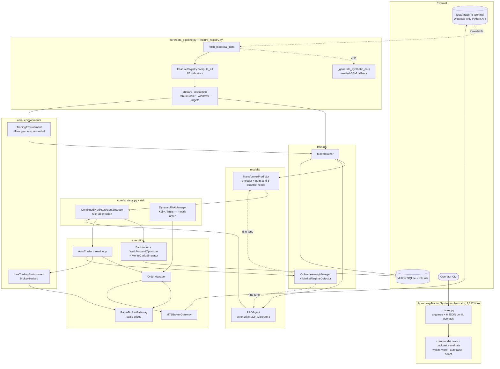
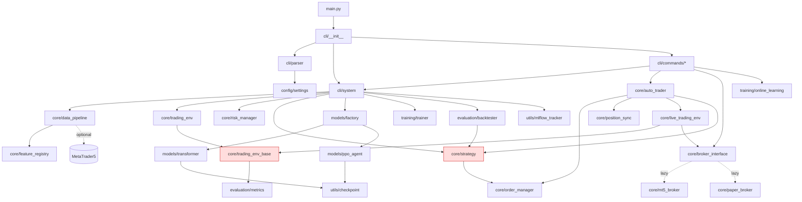
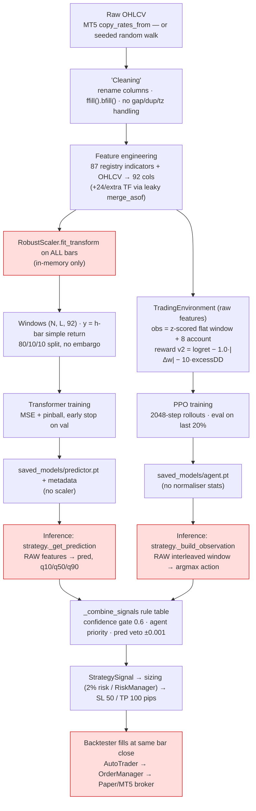
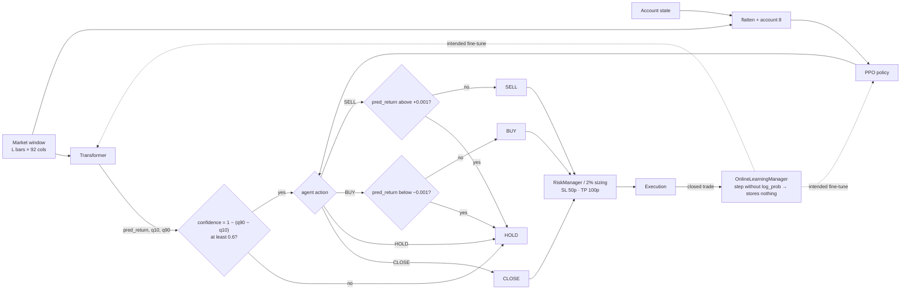
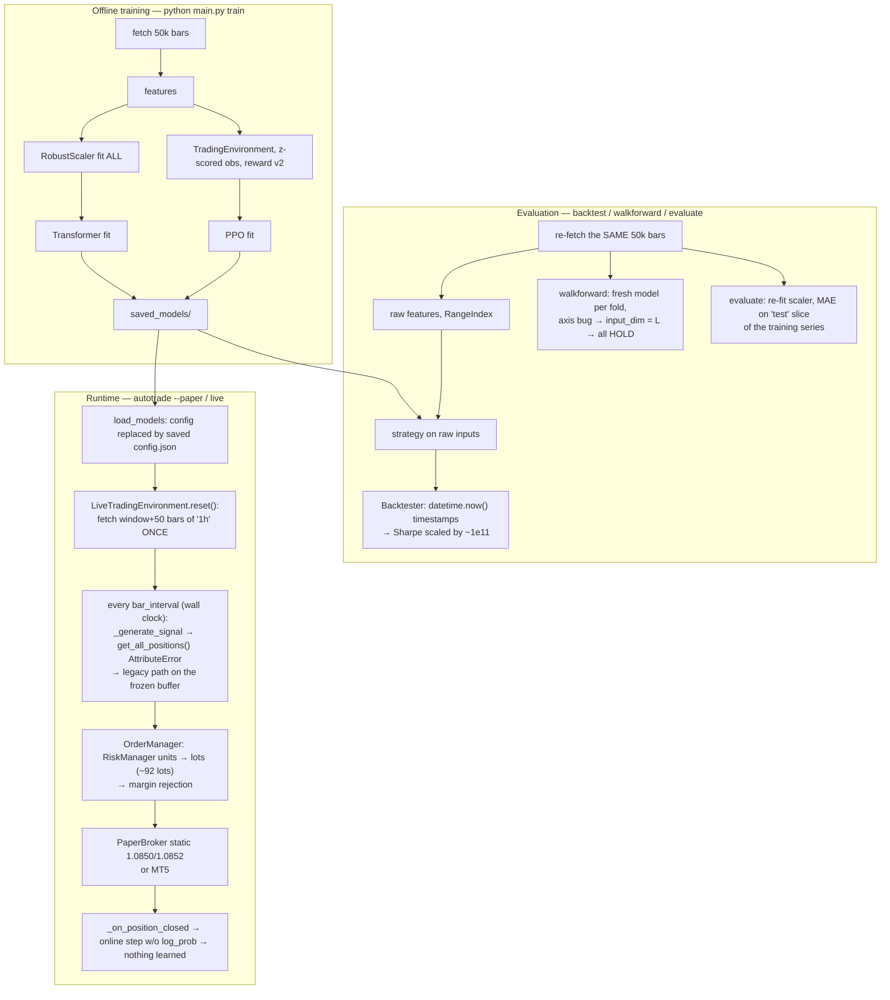
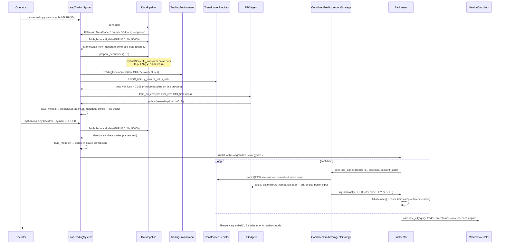
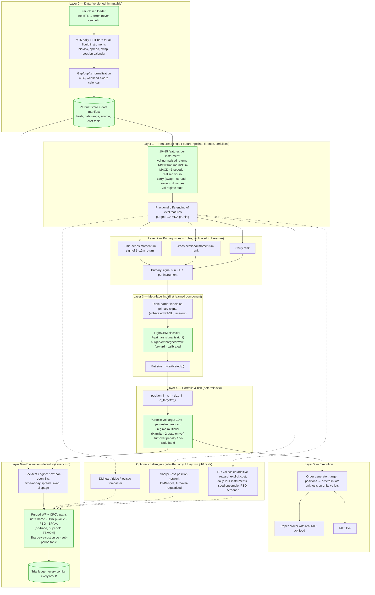

# Leap — Reverse-Engineering, Failure Analysis and Redesign Report

**Repository:** `osama1998H/Leap` — branch `develop` (code identical to `main` at `82318fb`; 47 documentation files removed in `aa79be6`)
**Analysis date:** 2026-09-16
**Method:** Six parallel investigations (architecture tracing, Git/GitHub archaeology, model audit, data audit, failure analysis with executed reproduction scripts, literature review), followed by independent re-verification of every load-bearing claim against the source. No application code was modified.

**Evidence labels used throughout:**
- **FACT** — read directly in the code or Git/GitHub history, or reproduced by running repository code on synthetic input (file:line references are to the `develop` branch).
- **INFERENCE** — a conclusion drawn from facts; confidence stated where it matters.
- **UNVERIFIED** — could not be checked in this environment (no MetaTrader 5, no real market data, no trained checkpoints in the repository).

---

## 1. Executive summary

Leap is a retail forex trading system for MetaTrader 5 (MT5). It trains a Transformer to forecast the next 6–12 hourly bars' return of one currency pair from 87 technical indicators, trains a PPO reinforcement-learning agent to choose buy/sell/hold/close from a flattened window of the same indicators plus account state, fuses the two with a rule table, and executes through a backtester, a paper broker or live MT5. It was almost entirely generated in eleven days (7–18 December 2025) across ~107 AI-assisted pull requests, on top of a 2023 Keras DQN/LSTM bot whose last commit message was "final work dqn no results".

**The system has never produced a trustworthy result, and could not have.** Five independent defects each make every backtest, paper-trade and live signal meaningless on their own:

| # | Defect (all FACT, all independently verified) | Where |
|---|---|---|
| 1 | The Transformer is trained on `RobustScaler`-scaled inputs, fit on the full dataset including test, but every inference path (backtest, walk-forward, live, adapt) feeds **raw, unscaled** prices and indicators. The scaler is never saved. Input magnitude differs by ~4 orders of magnitude. | `core/data_pipeline.py:1006-1011` vs `core/strategy.py:428-452` |
| 2 | The PPO agent is trained on a block-ordered, globally z-scored window that excludes the current bar, and served a row-interleaved, unscaled window that includes it. Same bars: training std 1.0, inference std ≈1922. The z-scoring itself collapses every price feature to a constant (std 3×10⁻⁶), so the agent could never see price information even in training. | `core/trading_env.py:247-258` vs `core/strategy.py:484-503` |
| 3 | On any machine without the Windows-only `MetaTrader5` package (the author's machine was macOS), every command **silently trains and backtests on a seeded random walk** with one log line. All recovered artefacts are consistent with this. | `core/data_pipeline.py:618,654-668` |
| 4 | The backtester's per-bar timestamp is `datetime.now()` because the CLI passes a `RangeIndex` DataFrame, so annualised Sharpe/volatility are scaled by ~10¹¹ and the "realistic" daily-trade cap allows 5 trades per backtest. | `cli/system.py:757-773`, `evaluation/backtester.py:258` |
| 5 | The live loop takes one market snapshot at start-up and never refreshes it; the primary strategy path always throws (`get_all_positions` does not exist) and falls back to a deprecated path; position size in units is sent to the broker as lots (≈90 lots on a $10k account). | `core/auto_trader.py:466,628`, `core/order_manager.py:439-457` |

Beyond the bugs, the **core design is unlikely to work even if bug-free**: the literature on intraday FX (Neely & Weller 2003/2011; Kozhan & Salmon 2010; Wood et al. 2022) finds no net-of-cost edge for technical signals at hourly horizons, the break-even directional accuracy at H1 with a 1-pip round trip is ≈56%, and the reward function's transaction-cost penalty (−0.1 per open/close) is ~1000× the per-bar return signal, so "never trade" is the reward-optimal policy the agent correctly learned.

**Recommendation in one line:** stop iterating on the Transformer+PPO stack; rebuild around a small, honest research loop (real data, purged walk-forward, cost model, naive baselines, deflated Sharpe) and test the only FX approaches with replicated evidence — diversified, volatility-targeted trend/carry across the whole MT5 instrument universe at daily horizon, with gradient-boosted meta-labelling as the first learned component.

---
## 2. What the repository is trying to do

### 2.1 Plain-English explanation

Leap wants to be an autonomous forex trading robot. Every hour it looks at the recent price history of a currency pair (EUR/USD by default) on a MetaTrader 5 account, computes about ninety technical indicators (moving averages, RSI, MACD, Bollinger bands, ADX, candle patterns, time of day, and so on), and asks two learned components what to do:

1. **A price forecaster** (a Transformer neural network) that predicts how much the price will move over the next 6–12 hours and how uncertain that prediction is.
2. **A trading agent** (a PPO reinforcement-learning policy) that looks at the same indicator window plus the account's current state (balance, open positions, drawdown) and picks one of four actions: hold, buy, sell, or close everything.

A small rule table then combines the two: the agent's choice wins unless the forecaster strongly disagrees or is not confident enough, in which case the system holds. If a trade is chosen, a risk manager sizes it, attaches a stop-loss and take-profit, and an order manager sends it to the broker (real MT5, or a simulated "paper" broker). An "online learning" component is meant to watch the results and periodically fine-tune both models so they adapt to changing market conditions.

The same models are supposed to be evaluated three ways before going live: a plain backtest over the historical data, a walk-forward test that retrains on rolling windows, and paper trading.

The intended path to profit is therefore: *good short-horizon forecasts + a learned policy that knows when to act on them + adaptive retraining → more winning trades than losing ones after spreads and commissions.*

### 2.2 Technical explanation

| Layer | What it actually is (FACT) |
|---|---|
| Data | `DataPipeline.fetch_historical_data` (`core/data_pipeline.py:594-697`) pulls `n_bars` (CLI default 50,000) of H1 OHLCV via `mt5.copy_rates_from`, or, if the `MetaTrader5` package is missing or not connected, generates a seeded geometric random walk (`:729-772`). `FeatureRegistry.compute_all` (`core/feature_registry.py:270-316`) computes 87 indicator columns; `_process_raw_data` (`:803-850`) does `ffill().bfill()`. Optional `--multi-timeframe` merges 24 features each from 15m/4h/1d via `merge_asof`. |
| Supervised target | `prepare_sequences` (`:977-1056`): X = `column_stack([O,H,L,C,V, features])` (92 columns) scaled by one `RobustScaler`; windows of `lookback_window` bars (120 default, 192 in the template); y = simple forward return `(close[t+h]-close[t])/close[t]`, h = `prediction_horizon` (12 default, 6 in template). Chronological 80/10/10 split by window index. |
| Forecaster | `TemporalFusionTransformer` (`models/transformer.py:279-405`): `Linear(92→128)` → sinusoidal positional encoding → 4 post-LN encoder layers (8 heads, FFN 512, GELU) → one extra self-attention block → last-timestep readout → Gated Residual Network → a point head and three quantile heads (0.1/0.5/0.9). Loss = MSE + 0.5·Σ pinball. AdamW 1e-4, ReduceLROnPlateau, early stopping patience 15. Despite the class name it has no variable-selection network in use, no static covariates, no LSTM encoder/decoder and single-horizon output; it is a vanilla encoder. |
| RL environment | `TradingEnvironment` (`core/trading_env.py`) over the same bars: observation = flattened `[prices[t-w:t], features[t-w:t]]` z-scored as one vector, plus 8 account features (`obs_dim = w·92+8`, e.g. 17,672); actions `Discrete(4)`; fills at `close[t]` ± spread/2 ± slippage, SL/TP ±2%/±4% checked on next bar's high/low; episode = 2,000 steps from a random start. Reward v2 (`core/trading_env_base.py:266-343`): `clip(log(E_t/E_{t-1}),±0.5) − 1.0·|Δw| − 10·max(0, DD−0.05)`, then clipped ±10 and running-normalised (`RewardNormalizer`, `models/ppo_agent.py:47-135`). |
| Agent | `PPOAgent` (`models/ppo_agent.py:405-1117`): shared MLP 256-256 with LayerNorm, actor 128→4 with tanh-bounded logits, critic 128→1; γ 0.99, λ 0.95, clip 0.2, entropy 0.01, 2048-step rollouts, 10 epochs, batch 64, cosine LR; eval every 10,000 steps on the last 20% of bars. |
| Fusion | `CombinedPredictorAgentStrategy._combine_signals` (`core/strategy.py:571-632`): `confidence = 1−(q90−q10)`; if < 0.6 → HOLD; agent CLOSE → CLOSE; agent BUY → BUY unless `pred < −0.001`; SELL symmetric; agent HOLD → HOLD. **The forecaster alone never opens a position.** |
| Risk & execution | `Backtester` (`evaluation/backtester.py`) with 2% risk-per-trade sizing, 50/100-pip SL/TP, spread/slippage/commission, optional cooldown and daily caps; `DynamicRiskManager` (Kelly/percent/volatility sizing, drawdown/daily/weekly limits) used only by the live `OrderManager`; `PaperBrokerGateway` / `MT5BrokerGateway`. |
| Adaptation | `OnlineLearningManager` (`training/online_learning.py`): every 100 steps, if mean |prediction error| > 0.05 or drawdown > 10%, one small gradient step on the last 50 samples for each model; a threshold-based `MarketRegimeDetector` that is logged but consumed by nothing. |
| Evaluation | `PerformanceAnalyzer`/`MetricsCalculator` (`evaluation/metrics.py`): Sharpe, Sortino, Calmar, drawdown, win rate, profit factor, VaR; `WalkForwardOptimizer` (180/30-day folds, fresh forecaster per fold, ±0.1% threshold rule, PPO not used); `MonteCarloSimulator` bootstrapping trade returns. |

---

## 3. Architecture

### 3.1 High-level system architecture (as built)

### 3.2 Module dependency graph (FACT, grep-verified)

Layering smells (FACT): `core/trading_env_base.py:14` imports `evaluation.metrics` (core → evaluation); `core/strategy.py:19` imports `core.order_manager` (offline strategy → live order layer); `core/mt5_broker.py:34-246` duplicates dataclasses defined in `core/broker_interface.py`.

### 3.3 Entry points, threads, artefacts (FACT)

- **Entry:** `python main.py <train|backtest|evaluate|walkforward|autotrade|adapt>`; `scripts/mlflow_ui.py`. No scheduler or server.
- **Threads:** `AutoTrader._trading_loop` (daemon, 1 s tick); `PaperBrokerGateway._position_monitor_loop` (daemon, 0.5 s SL/TP check); `AdaptiveTrainer` online thread (non-daemon, `adapt --mode online` only); optional `ThreadPoolExecutor(4)` in walk-forward (off by default).
- **Artefacts written:** `logs/leap*.log`; `checkpoints/{predictor,agent}_<ts>.pt` (never read by anything); `saved_models/{predictor.pt, agent.pt, model_metadata.json, config.json, training_history.json}`; `results/backtest_<ts>.json` (5 headline numbers); `data/<run>/` with `--save-data`; `mlflow.db` + `mlruns/`. **The fitted scaler is not among them.**
- **Configuration reality:** `config/settings.py` dataclass defaults differ from `config/templates/*.json` (lookback 120 vs 192, horizon 12 vs 6, PPO `total_timesteps` 1,000,000 vs 10,000, leverage 100 vs 400). Templates apply only with the matching `--*-config` flag. `load_models` then **replaces the running config with the saved `config.json`** (`cli/system.py:1101-1103`). Entire `RiskConfig`, `EvaluationConfig`, `seed`, `use_mixed_precision`, `normalize_method` and the three `use_*` feature toggles are never read (grep). There is no `torch.manual_seed` anywhere.

---
## 4. Historical implementation / Git archaeology

The local clone was shallow (107 commits); after `git fetch --unshallow` `origin/main` has **300 commits** from 2023-04-19. Authors: "Claude" 141, "Osama Muhammed" 96, "osama1998H" 63 (FACT). Almost every branch is `claude/<task>-<id>`; CodeRabbit reviewed every PR.

### 4.1 Timeline

| Phase | Dates | What happened (FACT) | What it tells us (INFERENCE) |
|---|---|---|---|
| 0. Prototype | 2023-04-19..22 (18 commits) | tf-agents DQN + Keras LSTM MT5 bot on a Windows desktop (`train_dqn.py`, `train_lstm.py`, `run_bot.py`, `.h5` and tfevents committed). Reward: +1 for *opening* a position, −1 for closing, else Δprofit (`6442133:utils/trading_env.py:72`). Last message: "final work dqn no results". | The objective (RL bot on EURUSD H1 via MT5) predates the AI rewrite and had already failed once. |
| 1. AI rewrite | 2025-12-07..08 (PR #1) | One commit (`02175ac`, author "Claude") lands the whole current architecture: TFT + PPO + online learning + walk-forward + risk manager + docs, 7,660 lines. 2023 files deleted (`af60b29`). | Architecture chosen up-front by the generator, not derived from data experiments. |
| 2. Make it run | 12-08 (PRs #2–#11) | First OHLCV shape mismatch (`253fae9`); backtester traded **49,792 of 50,000 bars → 10⁵⁶ % return** (`61af074`, PR #5) "fixed" with an *optional* `realistic_mode` cooldown, declared "not a bug"; owner commits checkpoints + results (`57188de`); MT5 auto-trader; Monte Carlo. | The first result was physically impossible and the response was to constrain trade frequency, not to ask why the signal traded every bar. |
| 3. Features/MLflow/dedup | 12-09 (PRs #13–#32) | Wilder ADX; second shape mismatch → persist `feature_names`; MLflow; a real test suite incl. `test_transformer/test_ppo_agent/test_trading_env/test_trainer/test_auto_trader` (`721c85b`); config values found never wired (`b18c41a`, `4cd5276`). | Shape contracts were already the recurring failure. |
| 4. Audit round 1 | 12-09..10 (PRs #33–#48) | Two "architecture mismatch" reports written, fixed, deleted; `live` command removed; **walk-forward found to be a stub** (`c4c473d`: `train_func` returned None, strategy always 'hold'); owner deletes all `.pt` checkpoints (`16cecf9`); PPO early stopping added with no eval env. | Features were shipping un-exercised; "done" meant "merged". |
| 5. UI detour | 12-10..11 | 11 spec docs + FastAPI `api/` + React `ui/` created and deleted the same day (`9298b4f`, ~110 files). | — |
| 6. Reward crisis | 12-11..16 (PRs #54, #61, #64, #67, #69, #74) | Reward rewritten four times in five days (§4.2). `1ea73fa` (PR #56, "performance") introduces `sliding_window_view` **without the transpose** — every model trained 12-11..12-18 saw (features, time) instead of (time, features). PR #67 finds reward was computed at the *entry* price (no time advance) so "agent learned to avoid trading". PR #68 finds autotrade **never connected to MT5 and traded on synthetic data**. | Root problems (reward scale, observation contract, data source) were each patched at the symptom. |
| 7. Audit round 2 + scaffolding | 12-13..18 (PRs #70–#102) | ARCHITECTURE_AUDIT (health "8.5→9.2/10") written, acted on, deleted; ADRs 0001–0014; `.claude/rules`; big refactors (broker Protocol, strategy pattern, FeatureRegistry, model factory, `cli/` package, `adapt` command). Owner deletes six model/env test files (`ec85cce`, 12-13) and PPO analysis docs; deletes results and configs (`b6142bb`); deletes `reward_analyzer.py` (`d73dd0d`) before v2 reward was ever measured. Last code commit `7be4721` (PR #102, transpose fix) 2025-12-18. | Architectural polish outpaced evidence: no trading metric appears in any audit. |
| 8. Abandonment | 2025-12-18 → 2026-09-16 | Issues #103–#107 filed on 12-18 (all still unfixed in code) and closed "not planned" on 2026-09-16; `develop` created by deleting 47 docs. | The owner stopped when walk-forward reported 0 trades on every fold (#107). |

### 4.2 Evolution of the reward function (FACT from diffs)

| Version | Commit / PR | Formula | Stated reason for change |
|---|---|---|---|
| v0 | `02175ac` | `100·ret − 10·max_drawdown − 0.0001·n_pos` | initial |
| v1 | `b51e1f6` #54 | `100·ret − 50·max(0,ΔDD) + 25·max(0,−ΔDD)` | max_drawdown is monotone → every reward negative ("9%→46% positive, mean −0.64→−0.12") |
| v1.1–1.2 | `85d1209`, `c23b1e6` #64 | scales 10/5/2.5 then 50/25/12.5, clip ±5, holding cost 0.001 | ratio overflow/NaN; then "10× too weak, value loss ≈ 0" |
| v1.3 | `19c4779` #67 | same, but step advanced before mark-to-market; SL/TP on high/low; margin | reward was measured at the entry price; agent learned to avoid trading |
| v1.4 | `543d4d7` #69 | `return_scale 50, dd 20, recovery 20, holding 0, clip 5`; component logging; `reward_analyzer.py` | asymmetry biased negative; holding cost dominated hourly data |
| **v2 (current)** | `6a057b7` #74 | `clip(log(E_t/E_{t−1}),±0.5) − 1.0·|Δw| − 10·max(0,DD−0.05)`, clip ±10, then Welford running normalisation | log-returns additive; penalise churn |

Legacy parameters (`return_scale`, `drawdown_penalty_scale`, `recovery_bonus_scale`, `holding_cost`) remain in `EnvConfig` unused. The v2 transaction-cost term was never measured: the diagnostic tool was deleted three days after v2 landed.

### 4.3 Bug fixes that reveal deeper problems

| Fix | What it did | Assessment |
|---|---|---|
| "Zero trades" (`d411b11`, PR #84) | Raised default `prediction_confidence` 0.5 → 0.7 so it passes the 0.6 gate. That default is used when `predictor is None` **or when `predict()` raises** (`core/strategy.py:370,383` swallow exceptions). The next day #101 showed `predict()` throwing on every bar. | **Band-aid.** Real cause was the predictor crashing silently; the fix makes the backtester trade on `predicted_return = 0.0` with a fabricated confidence. |
| float32 overflow (`4862ce1`) | Account ratios exceeded 3.4e38 at ~68% of a backtest → `sign·log1p` compression of observations. | **Band-aid.** Equity reaching 10³⁸× is the 12-08 compounding pathology returning once the agent was wired into the backtester; sizing/compounding untouched, symptom hidden. |
| Tensor shape #101 (`7be4721`, PR #102) | Added the transpose; made strategy include OHLCV; added inference-time `input_dim` assertion. | Real fix for the transpose, but no training-time assertion, still two observation builders, and #104 (adapt uses 87 not 92 features) was left open. Third recurrence of the OHLCV-inclusion mismatch (`253fae9`, `34175fd`, then regressed by `2bc2c70`/`55fb59a`). |
| Walk-forward stub (`c4c473d`, PR #43) | Implemented per-fold training and a ±0.1% threshold rule. | Introduced its own axis bug (no transpose; see §9) so walk-forward still trades nothing (#107). |
| Synthetic data in autotrade (`008a0cf`, PR #68) | Added `data_pipeline.connect()` to the autotrade path. | Correct for autotrade only; every other command still falls back silently. |
| PPO patience (`4404adb` → `619e73f` → `d411b11`) | Early stopping shipped with no eval env → warning + no-op for a week; then `eval_split=0.2` tail added. | Real fix; shows features shipping unexercised. |

### 4.4 Recovered documentation: claims vs code

Deleted docs (`README.md`, `ARCHITECTURE.md`, `docs/AI_NOTES.md`, `docs/IMPROVEMENT_PROPOSALS.md`, `docs/AUTO_TRADER.md`, ADRs 0001–0014) are historical claims. Spot-checked: `ARCHITECTURE.md` claims "Sharpe/Sortino-based reward shaping" and "gradient checkpointing" — **neither has ever existed in code** (FACT). `README.md` project tree omits `cli/`, `strategy.py`, `broker_interface.py`, `paper_broker.py`, `feature_registry.py`; references deleted files; declares MIT licence but no `LICENSE` file exists. `IMPROVEMENT_PROPOSALS.md` (12-17) lists "no unit tests for TransformerPredictor/PPOAgent/TradingEnvironment" as critical — those tests existed from 12-09 and were deleted by the owner on 12-13. Three audit reports scored "health" 8.5→9.2/10 without any trading metric.

### 4.5 Abandoned approaches

tf-agents DQN/LSTM (2023); TensorBoard/wandb flags (never implemented, removed #79); committed checkpoints and results (the only performance evidence, all negative, deleted); FastAPI+React UI (<1 day); six model/env test files; PPO analysis docs; `reward_analyzer.py`; three audit reports; `live` command; unmerged branches for CSV data source (`6712136`), separate training processes, MLflow-everywhere, and the proposal to delete the standalone `backtest` command (`e4de01f`).

---
## 5. Data sources and data pipeline

### 5.1 Raw data sources

| Source | Code | Provider / call | Frequency | Coverage | Columns | Timezone | Gaps / weekends | Bid/ask | Availability at inference | Licence / access |
|---|---|---|---|---|---|---|---|---|---|---|
| **MetaTrader 5 rates** | `core/data_pipeline.py:618-652` | `mt5.copy_rates_from(symbol, tf, datetime.now(), n_bars)`; `mt5.initialize()` with no login | primary `1h`; `15m/4h/1d` only with `--multi-timeframe` | `n_bars` = 50,000 by CLI default (≈8 years of H1, if the broker serves that much; count never checked) | `time,open,high,low,close,tick_volume,spread,real_volume` → renamed; `spread` **discarded**; `real_volume` used if non-zero else `tick_volume`, else constant 1000 (`:797-800`) | naive `pd.to_datetime(unit='s')`; MT5 stamps are broker-server time (INFERENCE) | none handled: no reindex, gap detection, dedup, sort; last bar is the forming bar (INFERENCE) | bid-based bars (INFERENCE from MT5 docs) | yes, same call | Python package is **Windows-only**; needs a running terminal and broker account |
| **Synthetic random walk** | `:654-668, 729-772` | `np.random.seed(42 + hash(tf) % 1000)`; `r ~ N(1e-4, 1e-2)`; `price = 1.1·exp(cumsum r)`; OHL uniform noise; volume `U(1000,10000)` | any | as requested | OHLCV | machine-local now | continuous 7-day calendar (weekends present) | n/a | **default whenever MT5 import or connect fails** — one WARNING + one INFO, no abort | — |
| **Paper-broker prices** | `core/paper_broker.py:55-118` | static dict (EURUSD 1.0850/1.0852) + tiny random walk | tick | — | bid/ask | — | — | yes | used by `autotrade --paper`; `use_real_prices=True` is set but no MT5 broker is passed so the static provider is always chosen (`cli/commands/autotrade.py:90-96`) | — |
| **Live tick → pseudo-bar** | `core/live_trading_env.py:590-609` | appends `[bid, ask, bid, bid, 0]` with **no features** | per `env.step()` (never called by AutoTrader) | — | — | — | — | — | dead path | — |
| CSV / other providers | — | **none**: `utils/data_saver.py` only writes; no loader; an unmerged branch (`6712136`) added CSV input | | | | | | | | |

Historical coverage actually used is UNVERIFIED: no data file is committed, and the author's environment (macOS per issues #81/#103) cannot install the `MetaTrader5` package, so all recovered artefacts were produced on the synthetic path (INFERENCE, high confidence).

### 5.2 Feature inventory and look-ahead assessment

All 87 registry features are trailing/causal at computation time (FACT: no `shift(-n)`, `center=True` or negative `pct_change`; empirically perturbing bars after K changed no feature at t ≤ K). Look-ahead enters only through post-processing.

| Group | Features | Formula / window | Causal at compute | Post-processing leak |
|---|---|---|---|---|
| Returns | `returns, log_returns, hl_ratio, oc_ratio, gap, tr` | 0–1 bar | yes | `hl_ratio/oc_ratio` use the forming bar in live (INFERENCE) |
| Trend | `sma/ema_{5,10,20,50,100,200}`, `close_sma_p_ratio`, `sma_5_20_cross`, `sma_20_50_cross` | p | yes | **bfill leak**: first p−1 rows copied from bar p−1 (`ffill().bfill()`, `data_pipeline.py:826`); 199 rows for `sma_200` |
| Oscillators | `rsi_{7,14,21}`, `rsi_wilder_14`, `macd/_signal/_hist`, `stoch_k/d_14`, `williams_r`, `roc_{5,10,20}`, `momentum_{10,20}`, `cci`, `mfi` | 5–26 | yes | bfill warm-up |
| Volatility | `atr_{7,14,21}`, `atr_wilder_14`, `bb_upper/lower/width/position_20`, `keltner_upper/lower`, `volatility_{10,20,30}` (√252 annualisation on hourly) | 7–30 | yes | bfill warm-up |
| Volume | `volume_sma_20`, `volume_ratio`, `obv`, `vpt`, `ad` | 20 / cumulative from first fetched bar | yes | cumsums depend on `n_bars` and are unbounded (non-stationary) |
| ADX family | `plus_di, minus_di, dx, adx, adxr, di_crossover, di_spread, adx_slope, adx_strength, adx_simple` | 14 (~28 warm-up) | yes | bfill warm-up |
| Candles | `body_size, upper_shadow, lower_shadow, is_bullish, is_doji, is_hammer, is_bullish_engulfing, is_bearish_engulfing` | 0–20 | yes | raw price units |
| Time | `hour, day_of_week, hour_sin, hour_cos, dow_sin, dow_cos` (+`day_of_month, month` in older checkpoints) | 0 | yes | broker time (MT5) vs machine time (synthetic) |
| Multi-TF | 24 hard-coded key features per extra timeframe (`_select_key_features`, `:951-970`) | — | — | **CRITICAL leak**: `merge_asof(direction='backward')` on the higher-TF bar's *open* time (`:913-918`) gives 1h bars at 00:00–02:00 the 4h bar whose close is 03:59. Verified: perturbing only the 03:00 bar changed all 24 `4h_*` features on the three preceding rows. Off by default. |
| Prepended | `open, high, low, close, volume` | 0 | yes | raw price levels; RobustScaler at train, unscaled at inference |

### 5.3 Ordered trace of the training data flow (`python main.py train --symbol EURUSD`)

1. `cli/parser.py:resolve_cli_config` — `n_bars = args.bars or 50000`, timeframe `1h`; multi-TF only with the flag.
2. `LeapTradingSystem.load_data` (`cli/system.py:116-157`) → `DataPipeline.connect()` (returns False without MT5; **return value ignored**) → `fetch_historical_data`.
3. `core/data_pipeline.py:618` — MT5 or synthetic (§5.1).
4. `_process_raw_data` (`:803-850`) → `FeatureRegistry.compute_all` → `df.ffill().bfill()` → optional multi-TF merge → `MarketData`.
5. `prepare_training_data` (`cli/system.py:159-181`) → `prepare_sequences(seq_len=lookback_window, horizon=prediction_horizon)`:
   - `column_stack([O,H,L,C,V, features])` → 92 columns (`:996-1003`);
   - **`RobustScaler().fit_transform` on all bars** (`:1006-1011`), stored only in memory;
   - `nan_to_num(0)`; target `y_t = (close[t+h] − close[t]) / close[t]` (`:1020-1022`);
   - `sliding_window_view` + transpose (`:1041-1045`, fixed in #102); `X[i]` = bars i..i+L−1, `y[i]` = return from bar i+L−1 → correct alignment (empirically verified).
6. `create_train_val_test_split` (`:1058-1074`) — chronological 80/10/10 **by window index, no purge/embargo**: the last training target overlaps the first 12 validation input bars; adjacent windows share 119 of 120 bars. `splits['test']` is only used by `evaluate`, which **re-fits a fresh scaler on freshly fetched data**.
7. `create_environment` (`cli/system.py:222-247`) → `TradingEnvironment(data=OHLCV, features=UNSCALED features)`; if `ppo.patience>0`, bars split 80/20 into train/eval envs (`:281-302`).
8. `ModelTrainer.train_predictor` → `TransformerPredictor.train`; `train_agent` → `PPOAgent.train_on_env`.
9. `save_models` (`cli/system.py:1028-1071`) → `.pt` files + `model_metadata.json` (input_dim, feature_names, window) + `config.json`. **No scaler, no reward-normaliser statistics.**
10. **Inference** (backtest `cli/system.py:729-873`; live `core/auto_trader.py:607-651`): raw DataFrame → `strategy._get_prediction` (`core/strategy.py:428-452`, unscaled) and `_build_observation` (`:484-503`, unscaled, row-interleaved, includes bar t).

### 5.4 Runtime data-flow diagram

```mermaid
flowchart LR
    subgraph Source
        A1[(MT5 copy_rates_from)] 
        A2[("seeded GBM<br/>random walk")]
    end
    A1 -- "if MT5 importable<br/>and connected" --> B
    A2 -- "otherwise, silently" --> B
    B["OHLCV DataFrame<br/>naive timestamps, no gap handling"]
    B --> C["FeatureRegistry.compute_all<br/>87 causal indicators"]
    C --> D["ffill().bfill()<br/>(warm-up rows get future values)"]
    D --> D2{"multi-timeframe flag?"}
    D2 -- yes --> E["merge_asof on bar-open time<br/>(future 4h/1d closes leak)"]
    D2 -- no --> F
    E --> F[MarketData]
    F --> G["prepare_sequences:<br/>OHLCV+features → RobustScaler fit on ALL bars<br/>→ windows (N,L,92) → y = (c(t+h)-c(t))/c(t)"]
    G --> H["80/10/10 split by index<br/>no purge"]
    H --> I[TransformerPredictor.train]
    F --> J["TradingEnvironment<br/>(raw features, global z-score per obs)"]
    J --> K[PPOAgent.train_on_env]
    I --> L[saved_models/predictor.pt]
    K --> M[saved_models/agent.pt]
    F -. "raw, unscaled,<br/>row-interleaved" .-> N[CombinedPredictorAgentStrategy]
    L --> N
    M --> N
    N --> O[Backtester / AutoTrader]
    classDef bad fill:#fdd,stroke:#c00;
    class A2,D,E,G,N bad;
```

### 5.5 Data-quality assessment against the checklist

| Concern | Finding | Severity |
|---|---|---|
| Look-ahead bias | Multi-TF merge (off by default) — CRITICAL when on; `bfill` warm-up rows — HIGH; backtester decides on `data.iloc[:i+1]` and fills at that bar's close (same-bar fill) — HIGH | CRITICAL/HIGH |
| Target leakage | Target alignment itself is correct. Scaler statistics include val/test (moderate). Split has no embargo: 12-bar target overlap and 119-bar input overlap at the boundary. | MEDIUM–HIGH |
| Survivorship bias | Single major pair; not applicable, but the universe is chosen after the fact. | n/a |
| Duplicated samples | Overlapping windows (stride 1) are used as i.i.d. samples with shuffling; effective sample size is ~1/L of nominal. No duplicate-bar detection. | MEDIUM |
| Future info in features | Only via the two mechanisms above. | see above |
| Train/test contamination | `backtest` re-fetches the **same 50,000 bars** used for training and evaluates on them (`cli/commands/backtest.py:46-51`); PPO eval env is the tail of the same series; `evaluate` runs the agent on the whole dataset. **There is no out-of-sample evaluation anywhere in the shipped commands.** | CRITICAL |
| Timestamps | Backtester timestamps are `datetime.now()` (§9); MT5 timestamps naive broker time; hour/dow features computed in broker time while trading hours are UTC. | CRITICAL for metrics |
| Timezone | No conversion anywhere. | MEDIUM |
| Missing market periods | Not handled. Synthetic data includes weekends (576 of 2,000 bars), MT5 data does not, so hour/day-of-week feature distributions differ between what models trained on and real data. Rolling windows straddle Friday→Sunday. | MEDIUM |
| Resampling | Higher timeframes fetched from MT5, not resampled; merge is the leak above. Walk-forward assumes 24 bars/day regardless of timeframe or weekends. | MEDIUM |
| Unadjusted prices | Spot FX; bid-only bars; spread column discarded so realised cost is not observable. | MEDIUM |
| Labels | 12-bar simple return, not winsorised; `direction` variant unused. | LOW |
| Class imbalance | Not handled; P(up) ≈ 0.44 on synthetic sample. | LOW |
| Dataset size | ~50,000 H1 bars ≈ 8 years, one series; ~2,900 effective independent 120-bar windows; far below what any published Transformer result used. | HIGH |
| Non-stationarity | Raw price levels, price-unit indicators and unbounded cumulative volume features (`obv/vpt/ad`) are inputs; no differencing; synthetic σ is 1%/bar (~78%/yr) versus ~0.1%/bar for real EURUSD, so any model trained on synthetic data is calibrated to a different regime. | HIGH |

---
## 6. Model inventory

Every predictive or decision-making component, learned or not. "Production use" traces whether the output actually reaches a trade decision in `backtest` or `autotrade`.

| # | Component | Model / algorithm | Implementation | Library | Purpose | Inputs | Target / rule | Training data | Output | Metric | Production use | Status |
|---|---|---|---|---|---|---|---|---|---|---|---|---|
| 1 | Price forecaster | Vanilla Transformer encoder (4 layers, d=128, 8 heads, post-LN, sinusoidal PE) + extra attention block + GRN + point head + quantile heads {0.1,0.5,0.9}; loss MSE + 0.5·Σpinball; AdamW 1e-4; early stop 15. **Not a TFT** (VSN defined at `transformer.py:189-277` but never instantiated; no static/known-future inputs, no LSTM, single horizon). | `models/transformer.py:279-405` (net), `408-762` (wrapper); `training/trainer.py:72-162` | PyTorch | Predict h-bar forward simple return with uncertainty | `(B, L, 92)`: OHLCV + 87 indicators; RobustScaler-scaled in training, **raw at inference** | `(close[t+h]−close[t])/close[t]`, h=12 (6 in template), unnormalised | 80% of one symbol's bars (synthetic on the author's machine) | point prediction + q10/q50/q90; `uncertainty = q90−q10` | train/val composite loss; test MAE on raw return scale (`evaluate`) | Loaded by `load_models`; called every bar by `strategy._get_prediction` in backtest and autotrade; walk-forward trains its own copy | **BROKEN** (train/inference scale mismatch; scaler fit on test; only vetoes, never initiates) |
| 2 | Trading policy | PPO actor-critic: shared MLP 256-256 (ReLU+LayerNorm), actor →128→4 with `tanh·10` logits, critic →128→1; GAE(0.99, 0.95), clip 0.2, entropy 0.01, 2048-step rollouts, 10 epochs, Adam 3e-4, cosine LR with hard-coded T_max; Welford reward normaliser | `models/ppo_agent.py:139-280, 405-1117`; env `core/trading_env.py`, `core/trading_env_base.py`; `training/trainer.py:164-290` | PyTorch, gymnasium | Choose HOLD/BUY/SELL/CLOSE | `L·92 + 8` floats (17,672 at L=192): flattened window z-scored as one vector (excludes bar t) + 8 log-compressed account ratios; **raw, interleaved, includes bar t at inference** | Maximise Σ normalised reward v2 | Same bars as forecaster; 2,000-step episodes from random starts; template trains only 10,000 steps (≈4 updates) | argmax action | raw episode reward; eval reward on last 20% of bars; PPO losses | `agent.select_action(obs, deterministic=True)` in backtest and (via legacy fallback) autotrade | **BROKEN** (observation contract mismatch; z-score erases price signal; cost penalty makes HOLD optimal; mean-subtracting normaliser changes the optimal policy) |
| 3 | Signal fusion | Deterministic rule table | `core/strategy.py:571-632` (`_combine_signals`); duplicate legacy copy `core/auto_trader.py:729-782` | — | Merge forecaster and agent | `pred_return`, `confidence = 1−(q90−q10)`, `agent_action`, `open_status` | confidence < 0.6 → HOLD; agent CLOSE → CLOSE; agent BUY → BUY unless pred < −0.001; SELL symmetric; agent HOLD → HOLD | — | `StrategySignal` (type, SL 50 / TP 100 pips, risk 2%) | — | backtest: primary path; autotrade: primary path always throws (§9) → legacy copy | Works as written but **forecaster never initiates**; confidence gate is vacuous for a trained model (spread of a return ≈ 0.01 → confidence ≈ 0.99) and fires only on the *default* 0.5/0.7 constant used when prediction fails. Not a model. |
| 4 | Risk manager | Kelly (half-Kelly after 20 trades, else 1% of balance), percent, volatility, fixed sizing; drawdown / daily / weekly / consecutive-loss limits; regime multipliers | `core/risk_manager.py:53-467` (`RiskManager`), `470-519` (`DynamicRiskManager`) | numpy | Size and gate live trades | balance, W/L history, exposure | deterministic formulas | — | units (not lots) | — | Live `OrderManager` only; not in training env, not in backtester | **QUESTIONABLE / inert**: `update_balance`, `record_trade`, `update_market_conditions` have zero runtime callers → Kelly never activates, every circuit breaker is dead, regime always "normal"; output units are sent as lots (§9). Deterministic logic, not a model. |
| 5 | Regime detector | Threshold rules on 50-bar trend and mean absolute return | `training/online_learning.py:51-94` | numpy | Label regime | closes, returns | vol>0.02 → high_vol; trend ±2% + SMA10 vs SMA50 → trending; vol<0.005 → low_vol; else ranging | — | string label | — | Updated in `step`, **consumed by nothing** (only logged). A second heuristic in `DynamicRiskManager.update_market_conditions` is never called. | **UNUSED**. Deterministic logic. |
| 6 | Online adaptation | Error/drawdown-triggered single gradient step (lr 1e-5) on the last 50 samples; off-policy PPO update from replay buffer with stale log-probs and 1-step TD targets | `training/online_learning.py:97-407`; `models/transformer.py:686-722`; `models/ppo_agent.py:966-1065` | PyTorch | Adapt to regime change | prediction errors, PnL, buffers | mean |error| > 0.05 or DD > 0.1, every 100 steps, ≤10/day | live trades | updated weights | mean error, simplified Sharpe | Wired into autotrade, but `step()` is called without `log_prob`/`value` so no RL transition is ever stored; forecaster is fed the flattened PPO observation reshaped to `(n,1,17672)` → shape error swallowed | **BROKEN / inert**. No forgetting prevention (no EWC, replay of old data, validation gate or rollback). |
| 7 | `adapt` CLI / `AdaptiveTrainer` | Plain offline fine-tune wrapper; threaded online stream | `training/online_learning.py:410-576`; `cli/commands/adapt.py` | — | Retrain on recent bars | features **without OHLCV**, unscaled, 1-bar horizon | — | last `--adapt-bars` | new checkpoint dir | MAE/RMSE/corr/direction accuracy (evaluate mode) | `adapt` only | **BROKEN** for any model produced by `train` (87 vs 92 inputs; issue #104) |
| 8 | Backtester | Event loop; fills at bar close ± spread/2 ± slippage; commission; SL/TP on next bars' high/low; 2%-risk sizing; cooldown/daily caps in realistic mode | `evaluation/backtester.py:76-676` | pandas | Simulate the strategy | OHLCV+features DataFrame | — | — | `BacktestResult` (equity curve, trades, metrics) | Sharpe/Sortino/Calmar/DD/PF/VaR via `MetricsCalculator` | `backtest` command | **QUESTIONABLE**: mechanics mostly right, but wall-clock timestamps (§9), same-bar fill, multiplicative pip maths, O(n²) slicing |
| 9 | Walk-forward | 180/30-"day" folds (24 bars/day hard-coded), fresh forecaster per fold (20 epochs), ±0.1% threshold rule | `evaluation/backtester.py:679-863`; `cli/system.py:875-1026` | — | Out-of-sample validation | raw unscaled columns | h-bar return | per fold | per-fold and aggregate metrics | mean/std return, Sharpe, DD, WR | `walkforward` | **BROKEN**: own axis bug → model with `input_dim = lookback`; strategy then returns HOLD on every bar (issue #107). Validates a different strategy (no PPO) than the one traded. |
| 10 | Monte Carlo | Bootstrap of per-trade `pnl_pct` | `evaluation/backtester.py:866-938` | numpy | Distribution of outcomes | closed trades | — | — | percentiles | — | `--monte-carlo` | Works, but compounds *notional* returns as equity (understates drawdown by leverage) and is unseeded. |
| 11 | Live environment | Broker-synced gym env | `core/live_trading_env.py` | — | Observations for live agent | buffered bars (fetched once) | — | — | obs | — | `AutoTrader._initialize_environments` | **BROKEN**: buffer never refreshed; timeframe hard-coded `'1h'`; pseudo-bars without features; pads/truncates observation to hide dimension errors |
| 12 | Paper broker | Static price table + tiny random walk; SL/TP monitor thread | `core/paper_broker.py:55-119, 165-903` | — | Simulated fills | constant tick | — | — | fills | — | `autotrade --paper` | **BROKEN as a P&L test**: constant price → every trade loses exactly the costs |
| 13 | Order manager | Validation + sizing + SL/TP placement | `core/order_manager.py:159-463` | — | Send orders | signal, symbol info, tick | confidence ≥ 0.5, spread ≤ max, RM allowed | — | broker order | — | live/paper | **BROKEN**: treats RiskManager units as lots (~92 lots on $10k) |

Things that look like models but are deterministic logic: #3, #4, #5, #8–#13. The only learned components are #1, #2 and their fine-tuning paths #6/#7.

**Checkpoint ↔ runtime consistency (FACT):** `save_models` writes `model_metadata.json` with `input_dim`, `feature_names`, `window_size`, `state_dim`; `load_models` rebuilds with those dims and refuses to load without metadata, so *dimensions* are consistent. What is not persisted: the `RobustScaler`, the `RewardNormalizer` running statistics, the training-time observation normalisation convention. `trainer.py` writes a second set of timestamped checkpoints in `checkpoints/` that nothing reads. The `checkpoint['config']` overwrites the constructed model's config on load (`transformer.py:750-751`), so architecture cannot drift, but the training-vs-template `max_seq_length` (120 vs 192) is resolved only because `system.py:196` forces it to `lookback_window`.

---
## 7. End-to-end execution flow

### 7.1 ML pipeline as actually implemented

### 7.2 Model interaction

Key structural facts: the Transformer's forecast is **not** an input to the PPO agent (they see the same window independently); the forecaster can only veto; the online-learning edge is inert.

### 7.3 Training vs inference vs evaluation vs runtime

### 7.4 Critical execution sequence: `train` then `backtest` (the workflow the owner actually ran)

---
## 8. What works (Category A — working as intended)

Genuinely correct and reusable pieces (all FACT, verified by reading and/or executing):

| Component | Evidence |
|---|---|
| Indicator computation | All 87 `FeatureRegistry` features are causal; dependency ordering via topological sort works; empirically no feature at t ≤ K changes when bars > K are perturbed (`core/feature_registry.py:270-316, 430-1375`). |
| Supervised target alignment | `prepare_sequences` aligns `X[i]` (bars i..i+L−1) with the return from bar i+L−1 to i+L−1+h; no off-by-one leak (`core/data_pipeline.py:1016-1051`, verified numerically). |
| RL environment step timing | Since PR #67: act at `close[t]`, mark-to-market and SL/TP on bar t+1 using high/low; margin check; end-of-data settlement (`core/trading_env.py:156-229, 440-478`). |
| Transformer training loop | Standard and sound: AdamW, grad clipping, ReduceLROnPlateau, early stopping with best-state restore, batched validation (`models/transformer.py:470-603`). |
| PPO core update | Standard clipped surrogate, GAE, advantage normalisation, log-ratio clamp, entropy bonus, orthogonal init (`models/ppo_agent.py:558-690`). |
| Backtester mechanics (except timestamps) | Spread/slippage/commission applied on entry and manual exit; SL/TP checked against high/low; risk-based sizing capped by leverage; realistic-mode caps (`evaluation/backtester.py:330-555`). |
| Metric formulas | Sharpe, Calmar, max drawdown, profit factor, VaR are algebraically standard (`evaluation/metrics.py`); `infer_periods_per_year` is correct *given* real timestamps. |
| Checkpoint dimension consistency | `model_metadata.json` carries `input_dim`, `feature_names`, `window_size`, `state_dim`; `load_models` rebuilds accordingly and refuses to load without it (`cli/system.py:1073-1232`). |
| Broker abstraction | `BrokerGateway` Protocol, `MT5BrokerGateway` retry logic, `PaperBrokerGateway` locking and SL/TP monitor thread are coherent (`core/broker_interface.py`, `core/mt5_broker.py`, `core/paper_broker.py`). |
| Monte Carlo bootstrap | Mechanically correct resampling (`evaluation/backtester.py:866-938`), modulo the notional-return caveat. |
| MLflow tracking | Params, per-epoch metrics, models and artefacts are logged; failures are swallowed as telemetry should be (`utils/mlflow_tracker.py`). |
| Test suite | 321 of 324 tests pass; the 3 failures are a pandas-3 `freq='H'` alias in `tests/test_integration.py:297,467`. |

## 9. What is broken (Category C — reasonable intent, defective implementation)

Ordered by impact. Each is fixable in isolation.

| # | Defect | Evidence (FACT) | Impact |
|---|---|---|---|
| C1 | **Forecaster inputs unscaled at inference; scaler never persisted; scaler fit on all data** | `core/data_pipeline.py:1006-1011` fits `RobustScaler` on the full 92-column array; grep for `scaler`/`transform(` in `core/strategy.py`, `core/auto_trader.py`, `cli/system.py`, `evaluation/backtester.py`, `core/live_trading_env.py` → zero hits; `inverse_transform_predictions` (`:1110-1121`) is a no-op. Measured: train |max| ≈ 4.5 vs inference |max| ≈ 33,000. | Every prediction in backtest, walk-forward, live and adapt is out-of-distribution. Reported forecasts are noise. |
| C2 | **PPO observation contract mismatch** | Training: `concat(prices[t−w:t].flatten(), features[t−w:t].flatten())`, global z-score, excludes bar t (`core/trading_env.py:247-258`). Strategy: `market_data[cols].tail(w).values.flatten()` (row-major), no scaling, includes bar t (`core/strategy.py:484-503`). Measured on identical bars: std 1.0 vs ≈1922. | The served policy sees inputs it never trained on; its actions are effectively arbitrary. |
| C3 | **Silent synthetic-data fallback** | `connect()` returns False without MT5 (`:575-585`); `load_data` ignores it (`cli/system.py:139`); `fetch_historical_data` generates GBM at INFO level (`:654-668`). Verified on this host: 2,000 synthetic bars returned with two log lines and no error. `--save-data` labels the source from a non-existent attribute → always "synthetic". | Everything the owner ran on macOS was on a random walk (INFERENCE, high confidence: issues #81/#103 show macOS paths; the MT5 package is Windows-only). |
| C4 | **Backtester timestamps are wall-clock** | `cli/system.py:757-773` builds the DataFrame without `market_data.timestamp` (RangeIndex); `evaluation/backtester.py:258` → `datetime.now()`. Measured: periods/year ≈ 3–5×10¹¹; Sharpe −1.6×10⁴; `--realistic` allows 5 trades per *backtest* because `max_daily_trades` is keyed on the wall-clock date. Same in walk-forward (`cli/system.py:883-896`). | All annualised metrics, trade durations and time-based constraints are meaningless. Commit 7b9b6ed's frequency inference is defeated by the caller. |
| C5 | **Walk-forward axis bug → zero trades** | `cli/system.py:930-931` uses `sliding_window_view` **without** the transpose added to `prepare_sequences` in #102 → `X_train.shape = (n, n_features, L)`, `input_dim = L`. `wf_strategy` (`:1025-1029`) then sees `len(cols) != input_dim` and returns HOLD on every bar; any exception also degrades to HOLD (`:986-988, 1047-1048`). | Issue #107: "walk-forward optimization is completely non-functional". The owner stopped here. |
| C6 | **Live data buffer never refreshes** | `_fetch_initial_data` only from `reset()` (`core/live_trading_env.py:311`, timeframe hard-coded `'1h'` at `:568`); `_update_data_buffer` only from `step()` (`:362`); `AutoTrader` never calls `env.step()` (grep: only `get_market_data` at `core/auto_trader.py:621`). Even `step()` would append `[bid, ask, bid, bid, 0]` with no features, after which `get_market_data()` drops all features (measured: 5 columns → "model expects 92"). | The live system evaluates the same frozen window forever. |
| C7 | **Primary live strategy path always throws** | `core/auto_trader.py:628` calls `position_sync.get_all_positions()`; `PositionSynchronizer` has only `get_positions` (`core/position_sync.py:257`). Caught at `:645` → `_generate_signal_legacy`. Separately, `strategy._build_account_observation` does `p.direction` (`core/strategy.py:549-550`) on `BrokerPosition` objects that only have `is_long/is_short` → caught → agent forced to HOLD whenever a position is open. | Issue #105 (never fixed). The strategy pattern is never the live decision path; the agent can never CLOSE in live. |
| C8 | **Units sent as lots** | `RiskManager.calculate_position_size` returns units (`core/risk_manager.py:189-266`, ≈92 for $10k @1.1); `OrderManager._calculate_position_params` clamps it against `volume_min/max` and sends as lots (`core/order_manager.py:439-457`). Measured: 92.15 lots = $10M notional → paper broker margin rejection. Exposure bookkeeping is asymmetric (open at `volume·price·contract_size`, close at `volume·price_open`). | Live/paper never trades, or trades catastrophically oversized. |
| C9 | **Paper broker uses static prices in the CLI path** | `cli/commands/autotrade.py:90-96` builds `PaperBrokerConfig(use_real_prices=True)` but never passes `mt5_broker`, so `DefaultPriceProvider` (EURUSD fixed 1.0850/1.0852, `core/paper_broker.py:61-72`) is chosen. | Paper P&L = −costs on every trade. |
| C10 | **Online learning cannot learn** | `_on_position_closed` calls `online_manager.step(...)` without `log_prob`/`value` (`core/auto_trader.py:976-983`); `store_transition` requires both (`training/online_learning.py:172-181`) → replay buffer stays empty (measured after 120 trades). `market_data['features']` is the flattened PPO observation; `_adapt_predictor` reshapes to `(n,1,17672)` → shape error swallowed. `actual_return = profit/entry_price` (~45 for $50) → error always > 0.05. | Adaptation is either a no-op or trains on garbage; the headline "online learning" feature does not exist functionally. |
| C11 | **`adapt` command feature mismatch** | `cli/commands/adapt.py:427-443` builds sequences from `market_data.features` (87 cols, no OHLCV, unscaled); models have `input_dim` 92. | Issue #104: crashes; never fixed. |
| C12 | **Multi-timeframe merge leaks future** | `merge_asof(direction='backward')` on the higher-TF bar-open time (`core/data_pipeline.py:913-918`); verified empirically. | With `--multi-timeframe`, 4h/1d features contain up to 3/23 hours of future data. |
| C13 | **Warm-up back-fill leaks future** | `df.ffill().bfill()` (`:826, 888, 930-931`); first 199 rows of `sma_200` equal bar 199. | Training samples in the warm-up region contain future information. |
| C14 | **Config plumbing** | `AutoTraderConfig` rebuilt with a subset of fields (`cli/commands/autotrade.py:138-150`) → intervals, hours, thresholds, daily-loss revert to defaults; `getattr(cfg,'initial_balance',10000)` on a field that does not exist; `load_models` replaces the whole config incl. absolute `base_dir`/MLflow URI; `RiskConfig`/`EvaluationConfig` unread; `critic_hidden_sizes` only logged; template `total_timesteps=10000` vs default 1,000,000; PPO `CosineAnnealingLR(T_max=100000//2048)` regardless of actual steps (`models/ppo_agent.py:469`). | Users cannot tell which settings are in force. |
| C15 | **Metric/statistics defects** | `MetricsCalculator.calculate_all` caches `periods_per_year` on the instance (`evaluation/metrics.py:73-74, 92-93`); two Sortino implementations disagree (`inf` vs 0); Monte Carlo compounds notional returns; final equity appended twice; `Trade.pnl_pct` is return on notional. | Secondary, but they would matter once C4 is fixed. |
| C16 | **Pip/spread maths** | `entry = price·(1 + spread_pips·0.0001/2 + slippage)`, `SL = entry·(1 − pips·0.0001)` (`evaluation/backtester.py:94, 379-406`): 50-pip SL becomes 55 pips on EURUSD and 73 JPY-pips on USDJPY; `commission = 7/100000` applied per side; no swap anywhere. | Costs and stop geometry wrong and symbol-dependent. |
| C17 | **Bar timing in live loop** | `_is_new_bar` = wall-clock elapsed ≥ `bar_interval` (3600 s fixed) since an arbitrary start (`core/auto_trader.py:784-807`), not broker bar boundaries. | Signals fire mid-bar at drifting times. |
| C18 | **Dead/unused surface (~1,500 lines)** | `StreamingDataBuffer`, `get_online_batch`, `MultiSymbolTradingEnv`, `PositionTracker`, all of `training/online_interface.py`, `trainer.train_combined/_train_curriculum_stage` (contains a `pass` placeholder), `MT5PriceProvider` (unreachable), exception hierarchy never raised, FeatureRegistry enable/disable API, factory auto-loaders, `AutoTrader.pause/resume/…`, `RiskManager.calculate_stop_loss/take_profit`. | Maintenance burden; audits counted them as features. |

## 10. What is broken by design (Category D — would not achieve the objective even if bug-free)

| # | Design decision | Why it cannot work (technical reason) | Evidence |
|---|---|---|---|
| D1 | **Objective: single-pair, hourly, technical-indicator direction forecasting as the profit source** | Break-even directional accuracy p* = 0.5 + c/(2·E\|r\|). With EURUSD σ ≈ 7%/yr, an H1 bar has E\|r\| ≈ 8 pips; a 1-pip round trip needs **≈56%** accuracy, 1.5 pips ≈ 59.5%; M15 needs 63–69%. Published daily FX accuracies top out around 58% on single test years without costs; intraday technical-rule studies find no net excess return (Neely & Weller 2003; Kozhan & Salmon 2010); the best TFT-based trading model's single-FX Sharpe turns negative at 1.5 bps (Wood et al. 2022). | §13 sources; own arithmetic in §13.3 |
| D2 | **Reward v2 transaction-cost term** | `tc_penalty = 1.0·\|Δw\|` with default position = 10% of balance → −0.1 on every open and every close. Per-bar log-return of a 10% position on a 0.1% move ≈ 1×10⁻⁴. Penalty ≈ 1,000× the signal and ≈5,000× the modelled spread+slippage (2×10⁻⁵). Under this reward "never trade" is the optimum; PPO learning HOLD is *correct*, not a bug. The `RewardNormalizer` rescales the sum, not the ratio. | `core/trading_env_base.py:303-307`; `core/trading_types.py:143,155`; `core/trading_env.py:299-301` |
| D3 | **PPO observation = one z-score over a flattened vector mixing prices (~1), volume (~10³–10⁴), RSI (0–100), returns (10⁻³)** | The global mean/std are dominated by volume; every price entry maps to the same z-value (measured std of z-scored close within a window = 3×10⁻⁶; 5,219 of 5,220 feature values inside \|z\|<0.1). The agent cannot see price movement even in training; it sees volume noise plus 8 account features. | `core/trading_env.py:257-258`; measured in failure audit |
| D4 | **Reward normaliser subtracts the running mean** | `(r − μ)/σ` (`models/ppo_agent.py:71-90`) makes the reward of "do nothing" negative whenever μ > 0 and positive whenever μ < 0, so the optimal policy depends on the running average of past rewards. Standard practice (SB3 `VecNormalize`) divides by the return std without centring. | INFERENCE from code |
| D5 | **Forecast-then-RL cascade on one noisy series** | Two learners stacked on an input whose predictable component, if any, is a fraction of a percent of variance (Gu-Kelly-Xiu: best-case R² 0.4%/month with millions of samples). The PPO reward's signal-to-noise is bounded by the forecaster's; the forecaster's output is not even in the agent's observation. ~2,900 effective independent windows cannot fit a 4-layer Transformer plus a 17,672-input MLP without overfitting. | §13; `core/trading_env.py:104-107` |
| D6 | **Fusion rule makes the forecaster veto-only** | The forecaster can never open a position (`agent is None → HOLD`), and the confidence gate `1 − (q90 − q10)` compares a return-quantile spread (≈0.01 for a trained model → confidence ≈ 0.99) to a probability threshold, so it only ever fires on the fallback constant. The "Transformer-only" mode advertised in `cli/system.py:~812` therefore always holds. | `core/strategy.py:571-632`; `models/transformer.py:669-673` |
| D7 | **Three divergent execution models** | Training env: fractional spread, SL/TP = ±2%/±4% of price (≈200/400 pips), size 10% of balance, no position cap. Backtester: 50/100 pips multiplicative, 2%-risk sizing, 5 positions. Live: absolute pips via `point·10`, RiskManager sizing, broker SL/TP. The policy is trained under mechanics it never trades under. | `core/trading_types.py:139-145`; `evaluation/backtester.py:401-406`; `core/order_manager.py:423-433` |
| D8 | **No out-of-sample evaluation exists in the workflow** | `backtest` re-fetches the training bars; `evaluate` scores a "test" slice of the same series with a re-fit scaler; PPO early stopping uses the tail of the same series; walk-forward tests a different strategy (no PPO). No purge/embargo, no baseline, no significance test, no trial counting. Any positive number would be uninterpretable (Bailey et al. 2014/2017; Harvey & Liu 2015). | `cli/commands/backtest.py:46-51`; `cli/commands/evaluate.py`; `cli/system.py:282-296` |
| D9 | **Online learning as implemented** | One gradient step on the last 50 samples, triggered by a 0.05 error threshold on a ~10⁻³-scale target (fires never or always), with no replay of old data, no validation gate, no rollback, off-policy PPO with stale log-probs and 1-step TD targets. This is a mechanism for catastrophic forgetting, not against it. | `training/online_learning.py:237-346`; `models/ppo_agent.py:966-1065` |
| D10 | **Regime detection as designed** | Threshold rules on a 50-bar window produce a label nobody consumes; even if consumed, regime *forecasting* is not where the literature finds value (Ang & Timmermann 2012) — regime *risk scaling* is. | `training/online_learning.py:51-94` |
| D11 | **Overlapping stride-1 windows shuffled as i.i.d. samples** | 50,000 bars → ~49,900 windows that share 119/120 bars; effective sample size ~1/L of nominal; early stopping on an adjacent, overlapping validation slice measures interpolation. | `core/data_pipeline.py:1041-1074`; `models/transformer.py:508` |
| D12 | **Feature set** | 87 collinear transforms of one price series, many in raw price units or unbounded cumulative sums, fed as levels with no differencing; plus raw OHLCV. Every extra feature is an extra "trial" for overfitting and a source of non-stationarity. | `core/feature_registry.py`; `core/data_pipeline.py:996-1003` |

### Category B — implemented but questionable

- Transformer architecture: sound as a vanilla encoder, but mislabelled TFT; whole-window attention with last-step readout on 120–192 steps is a heavy model for ~2,900 effective samples.
- PPO hyper-parameters: standard, but `total_timesteps=10,000` in the template gives ~4 updates and never reaches the first evaluation at 10,000 steps; `CosineAnnealingLR` horizon is unrelated to the run length.
- Position sizing and risk limits: reasonable formulas, but never fed (`update_balance`, `record_trade` have no callers) so Kelly and every circuit breaker are inert.
- Backtester: sound event loop, but same-bar fill (decide on bar i's close, fill at bar i's close) is optimistic relative to live next-tick fills.
- Walk-forward design: retrains per fold (good) but validates a predictor-only threshold rule, not the traded Transformer+PPO strategy, with a fixed ±0.1% threshold that a return forecaster rarely exceeds.

---

## 11. Reliability of existing results

**Inventory of every result artefact ever produced (FACT, recovered from history):**

| Artefact | Content | Verdict |
|---|---|---|
| `results/backtest_20251208_142246.json` | total_return **1.31×10⁵⁴**, Sharpe 6.24, max DD 0.865, win rate 0.41, **49,792 trades** in 50,000 bars | Physically impossible; produced by trading almost every bar with 2% risk compounding on (INFERENCE) synthetic data. PR #5 declared it "not a bug" and added an optional cooldown. |
| `results/backtest_20251208_145254.json` | +1.16%, Sharpe −0.80, DD 4.2%, WR 0.40, 5 trades | 5 trades = the `--realistic` daily cap under wall-clock timestamps (C4), not a strategy outcome. |
| `results/backtest_20251210_174332.json` | +1.16% (identical to 12 digits), Sharpe −0.79, 5 trades, "insufficient trades for Monte Carlo" | Identical return two days later → the model had no influence on the trades (the agent was not wired into the backtester until 12-17). |
| `results/backtest_20251210_180304.json` | **−4.68%**, Sharpe −1.59, WR 0.20, 5 trades | Negative. |
| `checkpoints/agent_*_info.json` (6 runs, 12-08..12-10) | every run `total_episodes: 2`, `final_reward` between **−20,694 and −67,044** | PPO never achieved a positive episode reward in any recorded run; 2 episodes for 100,000 steps means episodes were the whole 50k-bar series (fixed later by `max_episode_steps=2000`). |
| `checkpoints/predictor_*_info.json` (6 runs) | `best_val_loss` 0.0104–0.0160 in 16–21 epochs | See reproduction below: indistinguishable from a naive forecaster. |
| `saved_models/training_history.json` (12-09) | predictor 100 epochs, best val loss 0.01496, final val loss 0.0697 (diverged after best); agent 100,000 steps, `final_reward −20,694`, 2 episodes | Same. |
| `saved_models/model_metadata.json` | `input_dim 94`, `state_dim 11288` (=120·94+8); feature list includes `day_of_month`, `month` that no longer exist | Checkpoints from this era cannot be loaded by current code even if they existed; all `.pt` files were deleted (`16cecf9`). |
| MLflow runs, notebooks, confusion matrices, precision/recall | **None committed.** `mlflow.db`/`mlruns/` are git-ignored; no notebooks exist in any commit. | No evaluation of directional accuracy, calibration or per-trade statistics was ever recorded. |

**Reproduction with existing artefacts (no application code changed):** the recorded composite validation loss (MSE + 0.5·Σ pinball) was 0.0150. Simulating the pipeline's own synthetic process (`r ~ N(10⁻⁴, 10⁻²)`, 12-bar simple-return target) and scoring a *constant* forecaster that outputs the unconditional mean and quantiles gives **0.0142**; an all-zeros forecaster gives 0.0221. The trained Transformer therefore performed at the level of the unconditional distribution, which is exactly what a random walk permits. The range 0.0104–0.0160 across runs is consistent with different validation slices of the same process.

**Answers to the trust questions:**

| Question | Answer |
|---|---|
| Was the test set truly unseen? | No. `backtest` evaluates on the training bars; `evaluate` uses a slice of the same series with a re-fit scaler; PPO early stopping uses the tail of the same series. |
| Was temporal ordering respected? | Chronological splits, yes; but no purge/embargo, overlapping windows across the boundary, and the scaler saw the future. |
| Were transaction costs and slippage included? | Spread, slippage and commission yes (with wrong pip maths, C16); swap no; the reward's synthetic cost term is 5,000× the modelled real cost. |
| Was the model tuned on the test set? | Effectively yes: every reward/threshold/default change from 12-08 to 12-18 was judged by re-running on the same 50,000 bars. |
| Was the benchmark appropriate? | No benchmark exists (no buy-and-hold, no random policy, no zero-return forecaster, no TSMOM). |
| Are metrics statistically meaningful? | No: 5 trades; Sharpe annualised from microsecond timestamps; no confidence intervals or trial counts. |
| Could reported performance come from leakage? | The only "good" number (10⁵⁴%) came from compounding and same-bar fills; nothing else was positive. Leakage channels exist (scaler, bfill, multi-TF) but never produced a positive result to explain. |
| Would results survive production? | No: live path has never executed a correctly-sized order with fresh data (C6–C9). |
| **Were results even on market data?** | Almost certainly not (C3): the author's macOS environment cannot import `MetaTrader5`, and `config.json` from the checkpoint era shows `base_dir /Users/osamamuhammed/Leap`. |

## 12. Root causes of poor performance

Ranked by explanatory power:

1. **No data contract between training and inference** — scaling, feature order, window layout, current-bar inclusion and account-feature encoding each have two or three implementations that drifted independently (C1, C2, C11, D7). Four "shape mismatch" incidents in eleven days (`253fae9`, `34175fd`, #65, #101) were symptoms; the semantic mismatches never raised errors and were never fixed.
2. **No real data in the loop** — the silent synthetic fallback (C3) means the entire development cycle optimised against a random walk, where the correct answer for both models is "predict the mean" and "never trade". The recorded losses and rewards say exactly that.
3. **Reward geometry** — the cost penalty dwarfs the return signal (D2); the observation normalisation erases price information (D3); the normaliser centres rewards (D4). PPO converged to HOLD because HOLD was optimal.
4. **No evaluation framework** — every metric was computed on training data with wall-clock timestamps and no baseline (C4, D8), so there was never a number that could have exposed 1–3.
5. **Objective at the wrong horizon and universe** — even a perfect implementation of hourly single-pair technical forecasting is, by the published evidence, expected to earn ≈0 after retail spreads (D1).
6. **Process** — 300 commits in eleven days, three self-audits scoring "architectural health" with no trading metric, tests and diagnostics deleted when inconvenient, and each root cause patched at its most visible symptom.

---
## 13. Relevant academic research

Research area: **short-horizon exchange-rate predictability, machine learning for financial time series, deep RL for trading, and backtest methodology.** Fifteen sources were selected for relevance to Leap's actual failure mode (no edge after costs at intraday horizon; overfitting; degenerate RL policies). Verification status is noted; items marked † were confirmed by fetching the paper text, the rest by abstract/citation.

| # | Source | Methodology | Dataset | Reported result | Relevance to Leap | What to adopt | Limitations |
|---|---|---|---|---|---|---|---|
| 1 | López de Prado, M. (2018). *Advances in Financial Machine Learning*. Wiley. ISBN 978-1-119-48208-6 | Triple-barrier labels, meta-labelling, fractional differentiation, purged/embargoed k-fold, combinatorial purged CV (CPCV), sample weighting for overlapping labels, PBO/DSR | Methodological (E-mini tick examples) | Standard k-fold and naive walk-forward on overlapping labels leak and produce false discoveries | Leap uses fixed-horizon labels, stride-1 overlapping windows, no purge, no trial accounting — every problem the book addresses | Triple-barrier + meta-labelling; purged walk-forward + CPCV; fractional differencing of level features; MDA pruning | Prescriptive; written for tick data |
| 2 | Rossi, B. (2013). "Exchange Rate Predictability." *J. Economic Literature* 51(4):1063–1119. doi:10.1257/jel.51.4.1063 † | Survey + own OOS tests since Meese-Rogoff | Major USD pairs, monthly/quarterly | Predictability appears only with linear, few-parameter models on macro predictors (Taylor-rule, NFA); random walk very hard to beat at short horizons | Technical features on one price series are the weakest predictor set in this literature | Random-walk and no-trade baselines mandatory; low-parameter models; carry/rate differentials as features | Monthly horizons; pre-ML |
| 3 | Meese, R. & Rogoff, K. (1983). *J. Int. Economics* 14:3–24. doi:10.1016/0022-1996(83)90017-X † | OOS RMSE of structural models vs driftless random walk, 1–12 months | USD/GBP, DEM, JPY 1970s | Random walk ≥ every model even with realised future fundamentals | Origin of the FX random-walk prior | Diebold-Mariano / Clark-West tests vs random walk | Monthly; macro only |
| 4 | Neely, C. & Weller, P. (2011). "Technical Analysis in the FX Market." St. Louis Fed WP 2011-001; *Handbook of Exchange Rates* ch.12 † — summarising Neely & Weller (2003, *JIMF* 22:223–237), Curcio et al. (1997), Kozhan & Salmon (2010), Neely-Weller-Ulrich (2009, *JFQA* 44(2)) | Review of true OOS tests of technical rules incl. GA rules on half-hourly and tick data | Major pairs; intraday 1996, 2003, 2008 | "Once reasonable transaction costs are taken into account … no evidence of positive excess returns" (half-hourly); tick-data GA profits in 2003 gone by 2008 as algo share rose to 60%+; daily rule profits vanished by early 1990s | **Closest published analogue to Leap** (intraday, technical, learned rules, EURUSD-type pairs): no net profit, edge decays | Set the prior at ≈0 net edge; evaluate OOS with costs, normal hours only | Pre-2010; simpler rules than modern ML |
| 5 | Wood, K., Giegerich, S., Roberts, S. & Zohren, S. (2022). "Trading with the Momentum Transformer." arXiv:2112.08534 † | Decoder-only **TFT** trained directly on Sharpe loss, outputs vol-scaled positions; expanding walk-forward; 5 seeds | 50 liquid futures incl. FX, 1990–2020 | Portfolio Sharpe (gross): long 0.51, TSMOM 1.03, LSTM-DMN 1.70, TFT 2.54. **Single-asset FX Sharpe 2015–20: 0.28 @0 bps, 0.08 @1 bp, −0.02 @1.5 bps, −0.32 @3 bps**; vanilla Transformer FX −0.17 even gross | Same model family as Leap, strongest group in the field: FX is the weakest class and a 1-pip spread erases the single-asset edge; the Sharpe comes from diversification and direct objective optimisation | If a deep net is kept: Sharpe/utility loss, direct position output, vol scaling, turnover penalty, many instruments, daily bars | Futures, institutional costs; seed variance |
| 6 | Zhang, Z., Zohren, S. & Roberts, S. (2020). "Deep RL for Trading." *J. Financial Data Science* 2(2):25–40. arXiv:1911.10107 † | DQN/PG/A2C; **reward = volatility-scaled additive PnL − bps·|Δposition|**; features = normalised returns + MACD/RSI; baselines Long, Sign(R), MACD | 50 futures 2011–2019, daily | All-contract Sharpe: DQN 1.29, A2C 1.05, PG 0.75 vs Sign(R) 0.44. **FX sector: Long −0.35, Sign(R) −0.31, DQN 0.55** (weakest profitable sector); "time-series strategies … suffer losses in FX" | The credible DRL reference; its recipe (vol-scaled additive reward, explicit cost, daily, 50 contracts, simple features) is the opposite of Leap's | If RL is retained: vol-scaled additive reward with cost term; direct return features; sector baselines | 8-year test; no significance tests; A2C over-trades |
| 7 | Gu, S., Kelly, B. & Xiu, D. (2020). "Empirical Asset Pricing via Machine Learning." *RFS* 33(5):2223–2273. doi:10.1093/rfs/hhaa009 † | OLS/PLS/PCR/ENet/GLM/RF/GBRT/NN1–5; ~920 features; 30-yr rolling OOS; DM tests | ~30k US stocks, monthly, 1957–2016 | Monthly OOS R²: OLS-3 0.16%, RF 0.33%, GBRT 0.34%, **NN3 0.40% peak; NN4–5 no better**; long-short Sharpe 1.35 (VW) from the cross-section | Best-case ML predictability with millions of samples is < 0.5%/month; trees ≈ shallow nets; value comes from a cross-section, not one series | GBRT/RF baseline; shallow nets only if they win DM tests; expect R² in tenths of a percent | Equities, monthly, pre-cost |
| 8 | Zeng, A., Chen, M., Zhang, L. & Xu, Q. (2023). "Are Transformers Effective for Time Series Forecasting?" *AAAI-23*; arXiv:2205.13504 † | One-layer DLinear/NLinear vs Informer/Autoformer/FEDformer/Pyraformer; input-permutation ablations | 9 benchmarks incl. **Exchange-Rate** (8 daily FX series) | DLinear beats or matches all Transformers "in most cases by a large margin"; Transformer errors barely change when inputs are shuffled; on Exchange-Rate all models ≈ persistence | Undercuts the premise that a Transformer extracts more from 50k EURUSD bars than a linear or GBM model | DLinear/NLinear and persistence baselines; report MASE/pinball relative to persistence | Forecasting benchmarks, not trading PnL |
| 9 | Lim, B., Zohren, S. & Roberts, S. (2019). "Enhancing Time Series Momentum Strategies Using Deep Neural Networks." *JFDS* 1(4). arXiv:1904.04912 | Deep Momentum Networks: MLP/WaveNet/LSTM output the position directly, Sharpe-ratio loss, vol scaling | 88 futures 1990–2015 daily | Sharpe-loss LSTM ≈ 2× TSMOM gross; survives to 2–3 bps; MSE-trained forecasters translated into positions underperform | Learning the trading objective beats forecast-then-trade; edge survives only a few bps | Single bounded-position network with Sharpe/utility loss, or rules-based vol-targeted TSMOM | Institutional costs; futures |
| 10 | Moskowitz, T., Ooi, Y.H. & Pedersen, L.H. (2012). "Time Series Momentum." *JFE* 104(2):228–250; Hurst, Ooi & Pedersen (2012 AQR / *JPM* 2017) "A Century of Evidence on Trend-Following" † | Sign of 1–12-month return → long/short, constant ex-ante vol per instrument, 10% portfolio vol target, costs and 2/20 fees subtracted | 58 futures/forwards incl. currencies 1965–2009; 67 markets 1903–2012 | TSMOM significant in every instrument; HOP: **Sharpe 1.00 net of fees and costs 1903–2012**, positive every decade; authors' conservative forward assumption 0.4 | The most replicated systematic strategy; FX individually weak, works through diversification + vol targeting; sets the realistic ceiling for a rules-based system | Vol-targeted sizing; multi-instrument universe (MT5 offers 30–60 CFDs); daily/weekly rebalance | Hypothetical backtests by a manager; crowding since 2009 |
| 11 | Menkhoff, L., Sarno, L., Schmeling, M. & Schrimpf, A. (2012). "Currency Momentum Strategies." *JFE* 106(3):660–684 | Cross-sectional momentum across 48 currencies, bid-ask adjusted | 48 currencies vs USD, monthly, 1976–2010 | Winner–loser spread up to ~10% p.a. but "fairly sensitive to transaction costs"; concentrated in minor currencies | Where FX predictability actually lives (cross-section, monthly, carry/momentum) and that costs eat much of it | Cross-sectional ranking across MT5 pairs; carry (swap) as feature and signal | Monthly; minor pairs have wide retail spreads |
| 12 | Bailey, D., Borwein, J., López de Prado, M. & Zhu, Q. (2017). "The Probability of Backtest Overfitting." *J. Computational Finance* 20(4):39–69; Bailey & López de Prado (2014) "The Deflated Sharpe Ratio." *JPM* 40(5):94–107 | CSCV → PBO; expected max Sharpe under the null grows with √(2 ln N) trials; DSR adjusts for trials, skew, kurtosis | Analytical + simulation | With ~5 years of daily data a handful of trials yields a spurious in-sample Sharpe > 1 | Leap's reward/threshold/feature/default sweeps are trials; without PBO/DSR any positive backtest is uninterpretable | Log every trial; DSR p-value; PBO via CSCV over walk-forward paths | Requires disciplined trial logging |
| 13 | Harvey, C. & Liu, Y. (2015). "Backtesting." *JPM* 42(1):13–28; Harvey, Liu & Zhu (2016) *RFS* 29(1):5–68; White (2000) *Econometrica* 68(5); Hansen (2005) *JBES* 23(4) | Multiple-testing haircuts; **t > 3.0** hurdle; Reality Check / SPA bootstrap for "best of many rules vs benchmark" | Equity factors; White's original application was technical rules on S&P 500 | Realistic haircuts often exceed 50% of reported Sharpe; t ≈ 2 is meaningless after a search over dozens of rules | Ready-made test for "does the best Leap configuration beat no-trade / TSMOM after the search?" | Hansen SPA over all tried configurations; t > 3 equivalent | Needs the full set of trials incl. discarded |
| 14 | Millea, A. (2021). "Deep RL for Trading — A Critical Survey." *Data* 6(11):119; Hambly, Xu & Yang (2023) *Math. Finance* 33(3); Gort et al. (2022) arXiv:2209.05559 †; Mohammadshafie et al. (2024) arXiv:2407.09557 † | Surveys; PBO screening of DRL agents; behavioural comparison of DDPG/PPO/TD3/SAC/A2C | Equities/crypto, daily | Reported DRL profits "may suffer from the false positive issue due to overfitting"; DDPG/TD3/A2C "remain stationary for extended periods", PPO/SAC over-trade, and **passive A2C had the best cumulative reward** | Documents Leap's exact symptoms: hold-attractor policies, seed instability, reward-shaping sensitivity, overfit "successes" | RL only as a sizing layer on a pre-validated signal, seed ensembles, PBO screening — or drop RL | Surveys; stock environments |
| 15 | Makridakis et al. (2020) M4, *IJF* 36(1); (2022) M5, *IJF* 38(4); Lim, Arık, Loeff & Pfister (2021) TFT, *IJF* 37(4), arXiv:1912.09363; Fischer & Krauss (2018) *EJOR* 270:654–669; Krauss, Do & Huck (2017) *EJOR* 259:689–702 | Forecasting competitions; TFT design; LSTM/ensembles on S&P 500 constituents | M4 100k series; M5 retail; S&P 500 1992–2015 | M4: pure ML below statistical methods; M5 won by LightGBM ensembles; TFT validated on large multi-series datasets with covariates, never as a trading signal; Fischer-Krauss LSTM Sharpe 5.8 **pre-cost**, "as of 2010 … fluctuating around zero after transaction costs"; GBT/RF rivalled the DNN | TFT's home turf is many related series with covariates, not one noisy return series; trees win on tabular features; celebrated LSTM results were pre-cost and decayed | LightGBM/XGBoost as primary model class; results net of costs by sub-period; TFT optional challenger | Non-financial competitions; equities cross-section |

Supporting sources: Guyard & Deriaz (2024, arXiv:2409.04471) — best published daily EUR/USD directional accuracy 58.5%, one test year, no cost analysis; López-Herrera et al. (2025, *Discover AI*) — logistic regression with directional loss beat RF/XGB/NN on 8 pairs, "highly sensitive to transaction costs"; Hamilton (1989, *Econometrica* 57) and Ang & Timmermann (2012, *Ann. Rev. Fin. Econ.* 4) — regime switching useful for risk scaling, regime *forecasting* hard.

### 13.1 Research indicating the objective is unrealistic

Own cost arithmetic (assumptions: EURUSD annualised vol 7%, price 1.10 so 1 pip ≈ 0.9 bps, E|r| = σ√(2/π)):

| Bar | σ per bar | E\|r\| | Break-even directional accuracy at round-trip cost 0.5 / 1.0 / 1.5 pips |
|---|---|---|---|
| Daily | ≈48 pips | ≈39 pips | 50.6% / 51.3% / 51.9% |
| **H1 (Leap default)** | ≈10 pips | ≈8 pips | **53.2% / 56.3% / 59.5%** |
| M15 | ≈5 pips | ≈4 pips | 56.3% / 62.7% / 69.0% |

Standard retail EURUSD spreads are 0.7–1.0 pips (ECN ≈0.4–0.5 all-in), wider at news. No credible publication reaches 56–60% at hourly horizon; the best daily figures (55–58%, single years, no costs) sit below the H1 requirement. Combined with sources 4, 5, 6: **the objective "profit from next-hour EURUSD direction predicted by technical indicators" has no published support and strong published evidence against it.** The zero-trade policies Leap converged to are the honest answer to that question.

## 14. Comparison with established approaches

| Dimension | Leap (as built) | Evidence-backed approach | Expected improvement |
|---|---|---|---|
| Universe | 1 spot pair, 1 OHLCV series, ~50k bars | 20–50+ instruments (FX majors/crosses, metals, indices, energy CFDs available on MT5); edge from diversification (MOP; HOP; ZZR; Wood) | Single-asset FX Sharpe ≈0.1–0.3 gross in the best papers; diversified 0.4–1.0 net. Largest single gain available. |
| Horizon | H1 next-bar (6–12 bars) | Daily bars, 1–12-month look-backs, weekly/monthly rebalance (MOP; Menkhoff; Lim); intraday technical rules show no net profit (Neely & Weller) | Break-even accuracy falls from ≈56% to ≈51%; turnover falls 20–100× |
| Features | 87 collinear indicators incl. raw price levels and unbounded cumsums | ~10–15: normalised multi-horizon returns, MACD at 3 speeds, realised vol at 2 speeds, carry, spread, session (ZZR; Lim; Wood); fractional differencing; MDA pruning (AFML) | Lower variance and collinearity; fewer "trials"; carry is the only FX predictor with robust economic backing |
| Labels | Fixed-horizon simple return regression + quantiles | Triple-barrier labels with vol-scaled barriers; meta-labels on a rule-based primary signal (AFML); or no labels — learn position directly with Sharpe loss (Lim; Wood) | Labels match realised PnL mechanics; secondary model filters false positives |
| Forecaster | 4-layer Transformer, 92 inputs, ~2,900 effective samples | Baseline ladder: persistence → DLinear → ridge/logistic → LightGBM → deep net only if it wins DM/SPA (Zeng; GKX; M5) | Equal or better accuracy with 100× smaller tuning surface; avoids Transformer seed variance |
| Decision policy | PPO, discrete 4 actions, log-equity reward with cost penalty 1000× signal | position = clip(signal)·σ_target/σ̂, portfolio vol target (MOP; HOP; ZZR); if learned, Sharpe-loss network with turnover penalty (Lim); if RL, vol-scaled additive reward with explicit cost, daily bars, ≥20 instruments (ZZR) | Removes the zero-trade equilibrium; monotone auditable signal→position mapping |
| Costs | In reward (mis-scaled) and backtester (wrong pip maths, no swap) | Explicit round-trip cost in bps in every loss/metric; Sharpe-vs-cost curves 0–3 bps (Wood; Lim); normal-hours trading (Neely & Weller) | Prevents "profitable at 0 bps, negative at 1.5 bps" |
| Validation | In-sample backtest on training bars; wall-clock timestamps; no baseline | Purged/embargoed walk-forward; CPCV; PBO; Deflated Sharpe; Hansen SPA vs no-trade/TSMOM; t > 3 (AFML; Bailey et al.; Harvey-Liu; White; Hansen) | Turns "unstable results" into a measured false-discovery rate |
| Regime handling | Online fine-tuning + unused threshold detector | 2-state Hamilton MS on realised vol for exposure scaling; change-point features as inputs (Wood +17% Sharpe); scheduled retraining with purging | Stable interpretable risk control; no chasing noise |
| Success metric | Equity curve / total return | Net Sharpe with DSR p-value, PBO, DD, turnover, cost share, vs baselines by sub-period | Testable objective |

---
## 15. Proposed new architecture

### 15.1 Design principles (derived from §9–§14)

1. **Start from the problem and the data, not the model.** The first deliverable is a verified, versioned dataset of real MT5 bars for many instruments with a cost model — not a network.
2. **One data contract.** A single `FeaturePipeline` object that is fit once, serialised with the model, and applied identically in research, backtest and live. Every consumer receives the same array from the same function; shape *and* scale are asserted.
3. **Signals before learners.** Rules-based, replicated strategies (time-series momentum, cross-sectional momentum, carry) with volatility targeting are the baseline that any learned component must beat under a multiple-testing-aware test.
4. **Learn the decision that has evidence behind it.** The first learned component is a gradient-boosted meta-labeller that decides *whether and how much* to act on a rule-based primary signal, trained on triple-barrier labels with purged CV. Not a next-bar regressor, not an RL policy.
5. **Deterministic, auditable position sizing.** `position = clip(signal, −1, 1) · σ_target / σ̂ · p_calibrated`, aggregated to a portfolio volatility target with exposure caps. No Kelly on 5 trades, no RL sizing.
6. **Costs and regimes as first-class citizens.** Time-of-day spread, commission, swap and slippage are inputs to every loss and every metric; a two-state volatility regime scales exposure.
7. **Evaluation is the product.** Purged walk-forward, CPCV paths, deflated Sharpe, PBO and SPA tests are computed by default on every run and logged with the trial count.
8. **Deep models and RL are optional challengers**, admitted only if they beat the incumbent on net PnL under the tests in §16, with seeds ensembled and PBO screened.

### 15.2 Proposed pipeline

### 15.3 Why each change should improve the system

| Change | Replaces | Why it should help | Evidence |
|---|---|---|---|
| Fail-closed real-data loader, versioned Parquet store | Silent synthetic fallback, re-fetch per command | Every number becomes about the market; results reproducible; train/test contamination detectable by manifest | §9 C3, D8 |
| Single serialised `FeaturePipeline` with shape+scale assertions | Three divergent observation builders, unsaved scaler | Removes the entire class of train/serve mismatches that consumed most of the project's history | §9 C1, C2, C11; §4.3 |
| Multi-instrument daily universe | Single H1 pair | Diversification is where every replicated FX result gets its Sharpe; daily horizon cuts break-even accuracy from ≈56% to ≈51% and turnover 20–100× | MOP; HOP; ZZR; Wood; §13.1 |
| Rules-based TSMOM/CS-momentum/carry primary signals | Transformer forecast | Replicated for 100+ years across asset classes; zero parameters to overfit; interpretable | MOP; HOP; Menkhoff |
| Volatility-targeted deterministic sizing | PPO discrete actions + Kelly | Constant-risk sizing means "flat" is not the default; removes the zero-trade equilibrium and reward-scale non-stationarity; auditable | MOP; Lim; ZZR |
| Triple-barrier labels + LightGBM meta-labelling | Fixed-horizon return regression + rule fusion | Labels match realised PnL mechanics (stop/target/time-out); a calibrated secondary model filters false positives; trees match or beat nets on tabular features with far less tuning | AFML; GKX; M5; López-Herrera |
| 10–15 normalised, differenced features | 87 collinear indicators incl. raw levels and cumsums | Stationary inputs; fewer trials; lower variance; carry adds the one economically grounded FX predictor | AFML; ZZR/Lim/Wood feature sets; Rossi |
| Explicit cost model in loss and metrics, Sharpe-vs-cost curves | Mis-scaled reward penalty, wrong pip maths, no swap | Prevents discovering at 1.5 bps that the edge is gone | Wood Exh.10; Lim |
| Regime → exposure scaling | Regime → (nothing) / online fine-tuning | Regime detection has value for risk, not alpha; scheduled purged retraining avoids forgetting and leakage | Hamilton; Ang & Timmermann; Wood |
| Evaluation-by-default with trial ledger | In-sample backtest, no baseline, no trial count | Converts "unstable results" into a measured false-discovery probability; most configurations will fail, which is the correct outcome | Bailey et al.; Harvey-Liu; White; Hansen |
| Deep/RL as challengers only | Deep + RL as the core | They earn a place only by beating a strong baseline under SPA; if they do, the DMN/ZZR recipes are the ones with evidence | Lim; Wood; ZZR; Gort |

### 15.4 What to keep from the current codebase

Reusable with light changes: `FeatureRegistry` computation core (causal indicators, dependency ordering); `Backtester` event loop and SL/TP-on-high/low logic (after fixing timestamps, fills, pip maths and adding swap); `MetricsCalculator` formulas (after removing instance state); `BrokerGateway` Protocol, `MT5BrokerGateway`, `PaperBrokerGateway` (with a real price feed); `PositionSynchronizer`; MLflow tracker; the CLI skeleton and modular config loaders. Discard: `TradingEnvironment` reward/observation design, `PPOAgent` as decision layer, `OnlineLearningManager`, `MarketRegimeDetector`, `adapt` command, `LiveTradingEnvironment`, `CombinedPredictorAgentStrategy` fusion table, `DynamicRiskManager` Kelly path, all dead code listed in §9 C18.

---

## 16. Evaluation methodology

Define success before writing model code. Everything below is computed automatically for every run and written to a trial ledger.

### 16.1 Data protocol
- **Universe & period:** all MT5 instruments with median round-trip spread < 10% of daily E|r|; daily bars (H1 retained only for execution modelling); ≥ 10 years where the broker provides it. Frozen "final holdout" = most recent 18 months, touched once at the end.
- **Splits:** purged, embargoed walk-forward — train ≥ 4 years, test 6 months, step 6 months; purge = max label horizon; embargo = 5 days. CPCV with 6 groups → 15 paths for distributional statements.
- **Trial ledger:** every configuration (features, labels, model, sizing, cost assumption, seed) and its results are logged; N = number of trials feeds the deflated Sharpe.

### 16.2 Baselines (all must be reported next to any candidate)
1. **No-trade** (return 0, the random-walk-optimal policy).
2. **Buy-and-hold** each instrument, equal-vol weighted.
3. **TSMOM** sign(12-month return), vol-targeted, monthly rebalance (MOP).
4. **Persistence / zero forecaster** for any forecasting component; **DLinear** and **ridge/logistic** for any nonlinear forecaster.
5. **Random-action policy** and **always-flat policy** for any RL component.

### 16.3 Metrics and why they matter

| Metric | Why it is the one that matters |
|---|---|
| **Net annualised Sharpe** with bootstrap CI, after time-of-day spread + commission + swap + slippage | The only number comparable to the literature and to the baselines; costs are where FX strategies die |
| **Deflated Sharpe Ratio p-value** given N trials, skew, kurtosis | Answers "is this distinguishable from the best of N lucky draws?" |
| **Probability of Backtest Overfitting** (CSCV over CPCV paths) | Answers "does the in-sample winner underperform out of sample more often than not?" Target < 0.2 |
| **Hansen SPA test** of the candidate vs {no-trade, buy&hold, TSMOM} | Corrects for the search over configurations |
| Max drawdown, Calmar, time under water | Survivability with retail leverage |
| Turnover and cost share of gross PnL | Diagnoses cost sensitivity; Sharpe-vs-cost curve from 0 to 2× current cost |
| Sub-period table (yearly, by vol regime) | Detects decay (Fischer-Krauss post-2010 pattern) |
| For forecasters: pinball loss and MASE relative to persistence; directional accuracy with binomial CI; reliability diagram / Brier for probabilities | A forecaster is useful only if it beats persistence and is calibrated enough to size with |
| For meta-labels: precision/recall at chosen threshold, calibration, PnL of filtered vs unfiltered primary signal | The meta-labeller's job is to remove losing trades, not to predict direction |

### 16.4 Success criteria (explicit)
- **Gate 0 (data):** manifest reproduces byte-identical features on re-run; zero look-ahead in a perturbation test (perturb bars > K, assert no feature at ≤ K changes, including after multi-timeframe merge and fills).
- **Gate 1 (baselines):** the TSMOM baseline on the chosen universe achieves net Sharpe in [0.3, 1.0] over the walk-forward with plausible turnover. If it does not, the universe/cost assumptions are wrong — fix before any learning.
- **Gate 2 (meta-labeller):** filtered primary strategy beats unfiltered on net Sharpe on ≥ 70% of CPCV paths, SPA p < 0.05 vs TSMOM, DSR p < 0.05 with the true trial count, PBO < 0.2, and remains positive at 1.5× current costs.
- **Gate 3 (any deep/RL challenger):** beats the Gate-2 incumbent by ≥ 0.2 net Sharpe with SPA p < 0.05 across ≥ 5 seeds, PBO < 0.2, and no seed has negative net Sharpe.
- **Gate 4 (deployment):** 3 months paper trading on the real MT5 tick feed with realised costs within 20% of modelled; realised Sharpe inside the walk-forward CI.
- "Accuracy improved" or "reward increased" are **not** success criteria at any gate.

### 16.5 Ablations and robustness
- Feature ablations (drop each group), label ablations (fixed-horizon vs triple-barrier), sizing ablations (vol-targeting off), cost ablations (0 / 0.5× / 1× / 1.5× / 2×), universe ablations (FX only vs all CFDs), horizon ablations (daily vs H4 vs H1 — expected to show H1 failing the cost test).
- Robustness: bootstrap over instruments (leave-one-out), block-bootstrap of returns, shuffled-label test (must destroy performance), shifted-timestamp test (leading features by one bar must destroy performance — detects look-ahead), regime split (high/low vol), 2020 and 2022 stress periods.
- Out-of-distribution: instruments not used in training; the 18-month final holdout; a different broker's bars.

### 16.6 Latency/runtime constraints
Daily rebalance: feature computation and inference for 50 instruments must complete in < 1 minute on CPU; LightGBM meets this trivially. Live execution: orders sized in lots with unit tests; no model call on the critical path of order placement.

---

## 17. Experimental roadmap (ordered by information value)

Each experiment is designed to be cheap and to kill or confirm a hypothesis before the next investment.

**Experiment 1 — Establish real data and prove the pipeline is leak-free (1–2 days)**
Hypothesis: the project has never seen real data; a leak-free, versioned dataset is the prerequisite for every other question.
Change: on a Windows/MT5 host (or via a broker CSV export), pull ≥ 10 years of daily and H1 bars for all liquid instruments with spread and swap; write a fail-closed loader and a Parquet manifest; port the perturbation look-ahead test from this audit into CI.
Expected result: dataset manifest; look-ahead test passes; bfill and multi-timeframe leaks removed or shown absent.
Success: byte-identical re-runs; zero look-ahead.
If it fails: the broker cannot provide the history/costs needed → change broker or scope before doing anything else.

**Experiment 2 — Measure the ceiling: is there any hourly signal at all? (1 day)**
Hypothesis (from §13): H1 EURUSD direction from technical features is not predictable above the cost break-even.
Change: on the real data, purged walk-forward of {persistence, logistic regression, LightGBM} on the current 87 features predicting 1/6/12-bar direction; report accuracy with binomial CI against 50% and against the 56% break-even; compute realised net PnL of the sign strategy with real spreads.
Expected result: accuracy within ±1.5% of 50%; net PnL negative.
Success criterion for the *hypothesis*: accuracy CI excludes 56%.
What we learn if it fails (i.e., accuracy > 56% with CI): there is an intraday edge worth a data-leak audit first, then a serious H1 programme; the rest of this roadmap changes.

**Experiment 3 — Baselines on the multi-instrument daily universe (2 days)**
Hypothesis: vol-targeted TSMOM/carry across MT5 CFDs achieves net Sharpe 0.3–1.0, establishing a beatable incumbent.
Change: implement Layers 0–2 and 4 of §15 with the corrected backtester (next-open fills, real spreads, swap); run purged walk-forward; Sharpe-vs-cost curve.
Expected result: net Sharpe ≈ 0.4–0.8; FX-only sleeve near 0–0.3; drawdowns of 15–25%.
Success: Gate 1.
If it fails: costs at this broker are too high for daily systematic trading, or the universe is too narrow — this is decisive information about the business case before any ML.

**Experiment 4 — Meta-labelling with LightGBM (3 days)**
Hypothesis: a calibrated classifier on vol/regime/spread/session features can remove enough losing primary trades to raise net Sharpe by ≥ 0.2.
Change: triple-barrier labels on the Experiment-3 signals; LightGBM with purged CV; bet size ∝ calibrated probability; trial ledger; DSR/PBO/SPA.
Expected result: modest improvement (0.1–0.3 Sharpe) concentrated in cost reduction and drawdown; PBO < 0.2 if feature set is kept small.
Success: Gate 2.
If it fails: the learned layer adds nothing over rules → ship the rules-based system (still a working product) and stop investing in ML for this data.

**Experiment 5 — Forecaster challengers on the same rails (2 days)**
Hypothesis: DLinear/ridge on multi-horizon normalised returns does not beat persistence by an economically meaningful margin at daily horizon; the Transformer does not beat DLinear.
Change: plug forecasters into the primary-signal slot; DM tests vs persistence; DLinear vs the existing (scaler-fixed) Transformer.
Expected result: all near persistence; Transformer ≤ DLinear with higher variance.
Success: any forecaster passes Gate 3 against the Gate-2 incumbent.
If it fails: confirms §13 sources 7–8 for this data; retire the Transformer permanently.

**Experiment 6 — Sharpe-loss position network (optional, 3 days)**
Hypothesis: a DMN-style network with turnover penalty adds 0.2–0.5 gross Sharpe on the diversified universe and survives 1–2 bps.
Change: implement per Lim et al. (2019); 5 seeds; Sharpe-vs-cost curve.
Success: Gate 3.
If it fails at retail cost levels: document the cost at which it would work; do not deploy.

**Experiment 7 — RL as sizing layer (optional, only if 4–6 leave a gap) (1 week)**
Hypothesis: with a vol-scaled additive reward, explicit cost term, daily bars and ≥ 20 instruments, an agent can beat deterministic vol-targeting.
Change: ZZR recipe; 5 seeds; PBO screening; compared to always-flat and random policies.
Success: Gate 3.
If it fails: RL is closed for this project with evidence.

**Experiment 8 — Paper trading on real ticks (3 months, in parallel from Experiment 3 onward)**
Hypothesis: modelled costs and fills match reality within 20%.
Change: paper broker fed by the MT5 tick stream; orders in lots with unit tests; daily reconciliation against the backtest's expected trades.
Success: Gate 4.
If it fails: fix the cost model and re-run Gates 1–3 before any live capital.

---

## 18. Highest-priority fixes (if any part of the current code is kept)

In order; each is small, verifiable, and prevents the next false result.

1. **Fail closed on data**: raise if MT5 is unavailable unless `--synthetic` is passed explicitly; label every artefact with its data source (`core/data_pipeline.py:618-668`, `cli/system.py:139`).
2. **Persist and apply the scaler**: fit on the training split only, save alongside the model, apply in `strategy._get_prediction`, walk-forward, live and adapt; add a training-time and inference-time assertion on input mean/std (`core/data_pipeline.py:1006-1011`, `core/strategy.py:428-452`).
3. **One observation builder**: make `TradingEnvironment`, `CombinedPredictorAgentStrategy` and `LiveTradingEnvironment` call the same function with a golden-file test that asserts bit-identical output (`core/trading_env.py:247-258`, `core/strategy.py:484-503`, `core/live_trading_env.py:377-405`).
4. **Pass real timestamps to the backtester** (`cli/system.py:757-773`) and refuse to run without a `DatetimeIndex` (`evaluation/backtester.py:258`); fill at next bar open.
5. **Walk-forward transpose** (`cli/system.py:930-931`) — and make it evaluate the same strategy that is traded.
6. **Fix the reward scale** before any further PPO training: cost term in the same units as log-return (e.g. `spread·|Δw|`), normaliser without mean subtraction, per-feature standardisation of the observation (`core/trading_env_base.py:303-307`, `models/ppo_agent.py:71-90`, `core/trading_env.py:257-258`).
7. **Live loop**: refresh the bar buffer from the broker each bar using the configured timeframe; call `get_positions()`; map `BrokerPosition` to the strategy's expected interface (`core/auto_trader.py:466,621,628`, `core/live_trading_env.py:568`, `core/strategy.py:549-550`).
8. **Units → lots** conversion in `OrderManager._calculate_position_params` with a unit test on a $10k account (`core/order_manager.py:439-457`); symmetric exposure bookkeeping.
9. **Paper broker price feed** from MT5 ticks when available; otherwise refuse to report P&L (`cli/commands/autotrade.py:90-96`).
10. **Purge/embargo** in `create_train_val_test_split`; drop warm-up rows instead of back-filling; shift higher-timeframe timestamps by bar duration before `merge_asof`.
11. Remove online learning and `adapt` from the runtime until they have a design with a validation gate; delete dead code (§9 C18); pin `pandas<3` or fix the `freq='H'` tests.

## 19. Open questions / unknowns

| Question | Why it matters | How to resolve |
|---|---|---|
| Did the owner ever run on real MT5 data (Windows machine, exported CSV)? | If yes, some recovered numbers reflect market data; if no (our inference), *nothing* about market behaviour has ever been measured. | Owner to confirm; check for any local `data/` exports. |
| What MT5 broker, account type, spreads, commissions and swaps are available? | Determines Experiment 3's cost table and whether daily systematic trading is viable at all. | Export symbol specifications and 1 month of tick spreads. |
| Which instruments does the account offer with adequate history? | Universe size drives the achievable Sharpe more than any model. | `mt5.symbols_get()` + history depth per symbol. |
| Is the goal a research project or a live account? | Changes the acceptable evidence bar (Gate 2 vs Gate 4) and the value of the RL/Transformer work. | Owner decision. |
| Are the deleted `.pt` checkpoints or MLflow databases still on the owner's machine? | Would allow direct measurement of the served-vs-trained distribution shift and of the trained policy's action distribution. | Owner to check `saved_models/`, `checkpoints/`, `mlflow.db`. |
| Was the 12-08 astronomical backtest on synthetic data? | Affects whether the compounding pathology also exists on real data (it will, given same-bar fills and 2% risk per bar). | Reproduce on real data with corrected backtester. |
| UNVERIFIED items in this report | MT5 bar timestamp = open time; MT5 bars bid-based; `copy_rates_from` includes the forming bar; MetaTrader5 wheel availability on macOS. | Check against MT5 Python documentation on a Windows host. |

---

## 20. The five questions

**1. What did we actually build?**
A large (≈22k lines non-test), well-organised *scaffold* for a forecast-then-RL forex bot: a data pipeline with 87 causal indicators, a vanilla Transformer mislabelled as a TFT, a PPO agent over a 17,672-dimensional flattened window, a rule-table fusion layer, a backtester, a paper/MT5 broker layer, and an online-learning shell. Almost all of it was generated in eleven days and iterated against a seeded random walk because the MT5 package could not load on the author's machine.

**2. What parts genuinely work?**
The indicator library (causal, dependency-ordered), the supervised target alignment, the RL environment's step timing since PR #67, the Transformer and PPO training loops as generic ML code, the backtester's fill/SL/TP mechanics (except timestamps and pip maths), the metric formulas, checkpoint dimension bookkeeping, the broker abstraction and paper-broker threading, MLflow logging, and 321 passing unit tests. None of these has ever been connected end-to-end correctly.

**3. Why does it currently perform poorly?**
Because it cannot perform at all: (a) both models are served inputs with a different scale and layout from training; (b) every metric was computed on training data with wall-clock timestamps; (c) all development happened on synthetic data; (d) the reward's cost penalty is ~1000× the return signal and the observation normalisation erases price information, so PPO correctly learned to hold; (e) walk-forward has an axis bug that yields zero trades; (f) the live loop never refreshes data, always falls to a legacy path, and sizes orders 100× too large. Underneath the bugs, the objective — hourly single-pair direction from technical indicators — has no published evidence of net profitability at retail spreads.

**4. Is the core idea salvageable?**
The *infrastructure* idea (MT5-connected, systematic, backtested, risk-managed trading) is salvageable and about half the code can be reused. The *modelling* idea (Transformer next-bar forecast → PPO discrete policy on one pair at H1, with online fine-tuning) is not: it is broken by design on horizon, universe, reward geometry, observation design and evaluation, and the literature gives no reason to expect it to work if fixed. Fixing the eleven bugs in §18 would yield a system that trades — and, by the evidence, loses the spread.

**5. What should we build next instead?**
A small, honest research loop before any model: real multi-instrument daily MT5 data with a cost table (Exp. 1); a one-day test of whether any hourly edge exists (Exp. 2, expected: no); a volatility-targeted trend/carry baseline across the whole MT5 universe with purged walk-forward, deflated Sharpe and SPA tests (Exp. 3); then LightGBM meta-labelling on triple-barrier labels as the first and only learned component (Exp. 4). Transformers, Sharpe-loss networks and RL enter only as challengers that must beat that incumbent under multiple-testing-aware tests. The expected outcome is a modest, defensible net Sharpe of roughly 0.4–0.8 from diversification and risk control, which is what the evidence supports — not a prediction engine.

---

*Appendix — investigation artefacts (scratchpad, not committed): six agent reports (architecture, Git archaeology, models, data, failures, research), recovered deleted files (77, incl. `results/*.json`, `checkpoints/*_info.json`, `saved_models/model_metadata.json`, PPO analysis docs, deleted tests), reproduction scripts `t1`–`t7`, `verify_*.py`, `naive_loss.py`, and extracted paper texts.*
