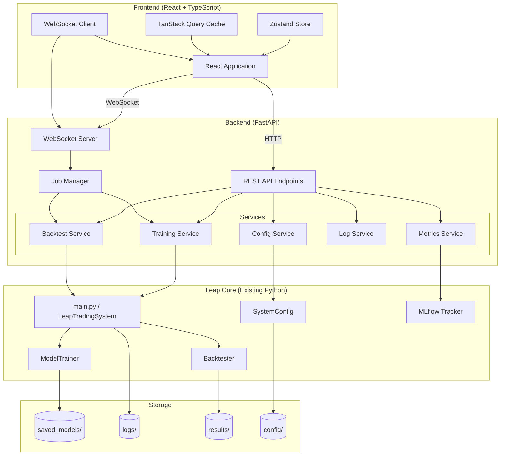
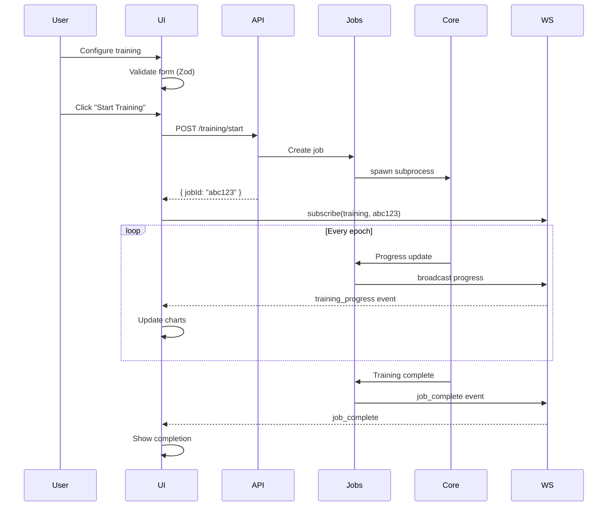
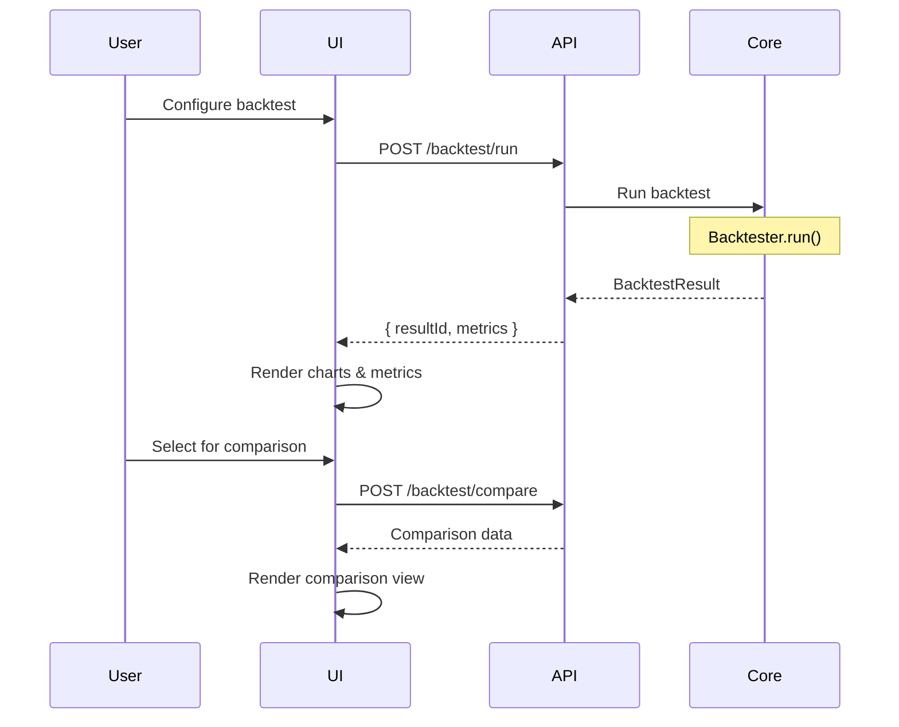
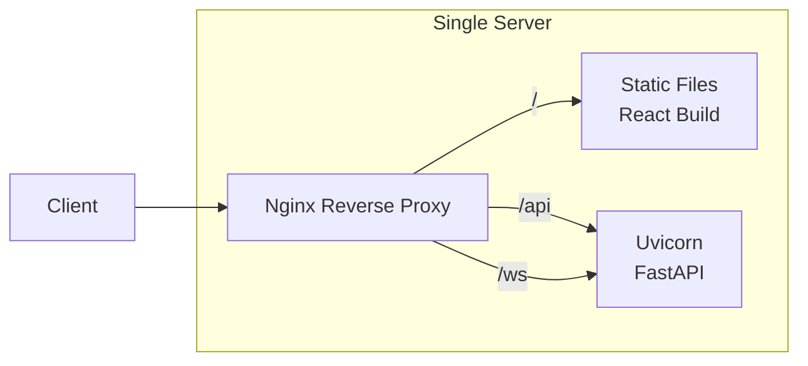

# UI Technical Architecture

## Overview

The Leap Trading System Web UI follows a modern React-based architecture with a Python backend API. The system provides real-time monitoring capabilities through WebSockets while maintaining RESTful APIs for standard CRUD operations.

---

## Tech Stack

### Frontend

| Category | Technology | Version | Rationale |
|----------|------------|---------|-----------|
| **Framework** | React | 18+ | Industry standard, excellent ecosystem |
| **Language** | TypeScript | 5.0+ | Type safety, better DX |
| **UI Components** | shadcn/ui | Latest | Radix primitives + Tailwind, accessible, customizable |
| **Styling** | Tailwind CSS | 3.4+ | Utility-first, works well with shadcn/ui |
| **State Management** | Zustand | 4.0+ | Simple, scalable, good for moderate complexity |
| **Data Fetching** | TanStack Query | 5.0+ | Caching, refetching, optimistic updates |
| **Charts** | Recharts | 2.10+ | React-native charts, works with shadcn |
| **Forms** | React Hook Form | 7.0+ | Performance, validation, shadcn integration |
| **Validation** | Zod | 3.0+ | TypeScript-first schema validation |
| **Build Tool** | Vite | 5.0+ | Fast HMR, modern bundling |
| **WebSocket** | Native WebSocket | - | Simple real-time communication |

### Backend

| Category | Technology | Version | Rationale |
|----------|------------|---------|-----------|
| **Framework** | FastAPI | 0.100+ | Async support, automatic OpenAPI docs |
| **WebSocket** | FastAPI WebSocket | - | Native FastAPI support |
| **Task Queue** | - | - | Optional: Celery for long jobs |
| **Validation** | Pydantic | 2.0+ | Request/response validation |

---

## System Architecture



---

## Component Architecture

### Frontend Application Structure

```
src/
├── app/
│   ├── layout.tsx              # Root layout with providers
│   ├── page.tsx                # Dashboard (home page)
│   └── (routes)/
│       ├── training/
│       │   ├── page.tsx        # Training configuration
│       │   └── [id]/page.tsx   # Training run details
│       ├── backtest/
│       │   ├── page.tsx        # Backtest configuration
│       │   └── [id]/page.tsx   # Backtest results
│       ├── walkforward/
│       │   └── page.tsx        # Walk-forward analysis
│       ├── experiments/
│       │   └── page.tsx        # MLflow experiment browser
│       ├── config/
│       │   └── page.tsx        # Configuration editor
│       └── logs/
│           └── page.tsx        # Log viewer
│
├── components/
│   ├── ui/                     # shadcn/ui components
│   │   ├── button.tsx
│   │   ├── card.tsx
│   │   ├── form.tsx
│   │   └── ...
│   │
│   ├── layout/
│   │   ├── Header.tsx
│   │   ├── Sidebar.tsx
│   │   └── PageContainer.tsx
│   │
│   ├── training/
│   │   ├── TrainingConfigForm.tsx
│   │   ├── TrainingProgress.tsx
│   │   ├── LossChart.tsx
│   │   └── TrainingRunCard.tsx
│   │
│   ├── backtest/
│   │   ├── BacktestConfigForm.tsx
│   │   ├── EquityCurveChart.tsx
│   │   ├── MetricsPanel.tsx
│   │   ├── TradeTable.tsx
│   │   └── MonteCarloChart.tsx
│   │
│   ├── config/
│   │   ├── ConfigEditor.tsx
│   │   ├── ConfigSection.tsx
│   │   └── PresetSelector.tsx
│   │
│   └── shared/
│       ├── MetricsCard.tsx
│       ├── StatusBadge.tsx
│       ├── LogViewer.tsx
│       └── FileTree.tsx
│
├── hooks/
│   ├── useTraining.ts          # Training API hooks
│   ├── useBacktest.ts          # Backtest API hooks
│   ├── useConfig.ts            # Config API hooks
│   ├── useWebSocket.ts         # WebSocket connection hook
│   └── useMetrics.ts           # Metrics streaming hook
│
├── stores/
│   ├── trainingStore.ts        # Training state
│   ├── backtestStore.ts        # Backtest state
│   └── uiStore.ts              # UI preferences
│
├── lib/
│   ├── api.ts                  # API client configuration
│   ├── websocket.ts            # WebSocket manager
│   ├── schemas.ts              # Zod validation schemas
│   └── utils.ts                # Utility functions
│
└── types/
    ├── training.ts             # Training types
    ├── backtest.ts             # Backtest types
    ├── config.ts               # Config types
    └── api.ts                  # API response types
```

---

## API Architecture

### REST API Endpoints

```
/api/v1/
├── /training
│   ├── POST   /start           # Start training job
│   ├── GET    /jobs            # List training jobs
│   ├── GET    /jobs/{id}       # Get job status/results
│   ├── POST   /jobs/{id}/stop  # Stop training job
│   └── GET    /jobs/{id}/logs  # Get job logs
│
├── /backtest
│   ├── POST   /run             # Run backtest
│   ├── GET    /results         # List backtest results
│   ├── GET    /results/{id}    # Get specific result
│   └── POST   /compare         # Compare multiple results
│
├── /walkforward
│   ├── POST   /run             # Run walk-forward
│   └── GET    /results/{id}    # Get WF results
│
├── /config
│   ├── GET    /                # Get current config
│   ├── PUT    /                # Update config
│   ├── GET    /templates       # List config templates
│   ├── POST   /templates       # Save template
│   └── POST   /validate        # Validate config
│
├── /models
│   ├── GET    /                # List saved models
│   ├── GET    /{id}            # Get model metadata
│   └── GET    /{id}/download   # Download model files
│
├── /logs
│   ├── GET    /files           # List log files
│   ├── GET    /files/{name}    # Get log file content
│   └── GET    /stream          # SSE log streaming
│
├── /metrics
│   ├── GET    /system          # System resource metrics
│   └── GET    /mlflow/runs     # MLflow run data
│
└── /health
    └── GET    /                # Health check
```

### WebSocket Events

```typescript
// Client → Server
interface WSClientMessage {
  type: 'subscribe' | 'unsubscribe' | 'ping';
  channel: 'training' | 'backtest' | 'logs' | 'system';
  jobId?: string;
}

// Server → Client
interface WSServerMessage {
  type: 'training_progress' | 'backtest_progress' | 'log_entry' |
        'system_metrics' | 'job_complete' | 'job_error' | 'pong';
  data: TrainingProgress | BacktestProgress | LogEntry |
        SystemMetrics | JobResult | ErrorInfo;
  timestamp: string;
}

// Training Progress
interface TrainingProgress {
  jobId: string;
  phase: 'predictor' | 'agent';
  epoch: number;
  totalEpochs: number;
  trainLoss: number;
  valLoss: number;
  learningRate: number;
  elapsedTime: number;
  estimatedRemaining: number;
}

// Backtest Progress
interface BacktestProgress {
  jobId: string;
  currentBar: number;
  totalBars: number;
  currentEquity: number;
  currentDrawdown: number;
  tradesExecuted: number;
}
```

---

## State Management

### Zustand Store Structure

```typescript
// Training Store
interface TrainingStore {
  // State
  activeJobs: Map<string, TrainingJob>;
  selectedJobId: string | null;
  configDraft: TrainingConfig | null;

  // Actions
  startTraining: (config: TrainingConfig) => Promise<string>;
  stopTraining: (jobId: string) => Promise<void>;
  updateJobProgress: (jobId: string, progress: TrainingProgress) => void;
  selectJob: (jobId: string) => void;
  setConfigDraft: (config: TrainingConfig) => void;
}

// Backtest Store
interface BacktestStore {
  // State
  results: Map<string, BacktestResult>;
  selectedIds: string[];
  isRunning: boolean;

  // Actions
  runBacktest: (config: BacktestConfig) => Promise<string>;
  loadResult: (id: string) => Promise<void>;
  selectForComparison: (ids: string[]) => void;
  clearResults: () => void;
}

// UI Store
interface UIStore {
  // State
  theme: 'light' | 'dark' | 'system';
  sidebarCollapsed: boolean;
  activeNotifications: Notification[];

  // Actions
  setTheme: (theme: Theme) => void;
  toggleSidebar: () => void;
  addNotification: (notification: Notification) => void;
  dismissNotification: (id: string) => void;
}
```

### TanStack Query Keys

```typescript
const queryKeys = {
  training: {
    all: ['training'] as const,
    jobs: () => [...queryKeys.training.all, 'jobs'] as const,
    job: (id: string) => [...queryKeys.training.jobs(), id] as const,
    logs: (id: string) => [...queryKeys.training.job(id), 'logs'] as const,
  },
  backtest: {
    all: ['backtest'] as const,
    results: () => [...queryKeys.backtest.all, 'results'] as const,
    result: (id: string) => [...queryKeys.backtest.results(), id] as const,
  },
  config: {
    all: ['config'] as const,
    current: () => [...queryKeys.config.all, 'current'] as const,
    templates: () => [...queryKeys.config.all, 'templates'] as const,
  },
  models: {
    all: ['models'] as const,
    list: () => [...queryKeys.models.all, 'list'] as const,
    detail: (id: string) => [...queryKeys.models.list(), id] as const,
  },
};
```

---

## Authentication Approach

### Phase 1 (MVP): No Authentication
- Single-user local deployment
- Backend binds to localhost only
- No sensitive data exposed

### Phase 2 (Future): Basic Authentication
- Simple session-based auth
- Environment variable for admin password
- Rate limiting on API endpoints

---

## Data Flow Examples

### Training Launch Flow



### Backtest Results Flow



---

## Error Handling

### Frontend Error Boundaries

```typescript
// Global error boundary for unhandled errors
<ErrorBoundary fallback={<ErrorPage />}>
  <App />
</ErrorBoundary>

// Component-level for graceful degradation
<ErrorBoundary fallback={<ChartError />}>
  <EquityCurveChart data={data} />
</ErrorBoundary>
```

### API Error Response Format

```typescript
interface APIError {
  error: {
    code: string;          // e.g., "VALIDATION_ERROR"
    message: string;       // Human-readable message
    details?: Record<string, string[]>;  // Field-level errors
  };
  requestId: string;       // For debugging
}
```

### WebSocket Reconnection

```typescript
const useWebSocket = (url: string) => {
  const [status, setStatus] = useState<'connecting' | 'connected' | 'disconnected'>('connecting');

  useEffect(() => {
    let ws: WebSocket;
    let reconnectAttempts = 0;
    const maxAttempts = 5;

    const connect = () => {
      ws = new WebSocket(url);
      ws.onopen = () => {
        setStatus('connected');
        reconnectAttempts = 0;
      };
      ws.onclose = () => {
        setStatus('disconnected');
        if (reconnectAttempts < maxAttempts) {
          setTimeout(connect, Math.pow(2, reconnectAttempts) * 1000);
          reconnectAttempts++;
        }
      };
    };

    connect();
    return () => ws.close();
  }, [url]);

  return status;
};
```

---

## Security Considerations

1. **Input Validation**: All API inputs validated with Pydantic (backend) and Zod (frontend)
2. **Path Traversal Prevention**: Sanitize file paths for log/model access
3. **Rate Limiting**: Prevent API abuse (future phase)
4. **CORS**: Strict origin policy, localhost only in MVP
5. **No Secrets in Frontend**: MT5 credentials stay in backend environment variables
6. **Content Security Policy**: Strict CSP headers

---

## Deployment Architecture

### Development

```bash
# Frontend (Vite dev server)
cd ui && npm run dev  # localhost:5173

# Backend (FastAPI with hot reload)
cd api && uvicorn main:app --reload  # localhost:8000
```

### Production



```nginx
# nginx.conf example
server {
    listen 80;

    location / {
        root /var/www/leap-ui;
        try_files $uri $uri/ /index.html;
    }

    location /api {
        proxy_pass http://localhost:8000;
    }

    location /ws {
        proxy_pass http://localhost:8000;
        proxy_http_version 1.1;
        proxy_set_header Upgrade $http_upgrade;
        proxy_set_header Connection "upgrade";
    }
}
```

---

## Performance Optimizations

1. **Code Splitting**: Lazy load route components
2. **Chart Virtualization**: Only render visible data points for large datasets
3. **WebSocket Throttling**: Batch updates to max 10/second
4. **Query Caching**: TanStack Query with appropriate stale times
5. **Compression**: Gzip API responses
6. **Static Asset Caching**: Long cache headers for built assets
