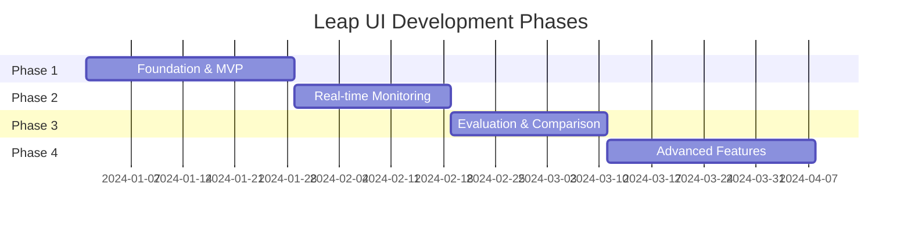

# Implementation Roadmap

This document outlines the phased development plan for the Leap Trading System Web UI.

---

## Phase Overview

---

## Phase 1: Foundation (MVP)

**Goal**: Basic training launch, backtest execution, and results viewing.

### Backend Tasks

| Task | Description | Priority | Dependencies |
|------|-------------|----------|--------------|
| B1.1 | FastAPI project setup | Critical | None |
| B1.2 | Config service (CRUD for SystemConfig) | Critical | B1.1 |
| B1.3 | Training service (start/stop jobs) | Critical | B1.1 |
| B1.4 | Backtest service (run backtests) | Critical | B1.1 |
| B1.5 | Models service (list/download) | High | B1.1 |
| B1.6 | Job manager (process spawning) | Critical | B1.3 |
| B1.7 | Logs service (file reading) | Medium | B1.1 |
| B1.8 | API documentation (OpenAPI) | Medium | B1.1-B1.7 |

### Frontend Tasks

| Task | Description | Priority | Dependencies |
|------|-------------|----------|--------------|
| F1.1 | Vite + React + TypeScript setup | Critical | None |
| F1.2 | shadcn/ui installation and theme | Critical | F1.1 |
| F1.3 | App layout (header, navigation) | Critical | F1.2 |
| F1.4 | Dashboard page (basic) | High | F1.3 |
| F1.5 | Training config form | Critical | F1.2 |
| F1.6 | Training launch integration | Critical | F1.5, B1.3 |
| F1.7 | Backtest config form | Critical | F1.2 |
| F1.8 | Backtest results page | Critical | F1.7, B1.4 |
| F1.9 | Simple log viewer | Medium | F1.3, B1.7 |
| F1.10 | API client setup (TanStack Query) | Critical | F1.1, B1.1 |

### Deliverables

- [ ] Backend API running locally
- [ ] React app with basic routing
- [ ] Training configuration and launch
- [ ] Backtest configuration and results viewing
- [ ] Basic logging visibility

### Definition of Done

- User can configure and start a training run via UI
- User can run a backtest and view results
- User can view recent log entries
- All core API endpoints documented

---

## Phase 2: Real-time Monitoring

**Goal**: Live training progress visualization with WebSocket updates.

### Backend Tasks

| Task | Description | Priority | Dependencies |
|------|-------------|----------|--------------|
| B2.1 | WebSocket server setup | Critical | B1.1 |
| B2.2 | Training progress streaming | Critical | B2.1, B1.6 |
| B2.3 | Log streaming (SSE/WebSocket) | High | B2.1, B1.7 |
| B2.4 | System metrics endpoint | Medium | B1.1 |
| B2.5 | Training job control (pause/stop) | High | B1.6 |
| B2.6 | Backtest progress streaming | Medium | B2.1 |

### Frontend Tasks

| Task | Description | Priority | Dependencies |
|------|-------------|----------|--------------|
| F2.1 | WebSocket client hook | Critical | B2.1 |
| F2.2 | Training monitor page | Critical | F2.1 |
| F2.3 | Loss curve chart (Recharts) | Critical | F2.2 |
| F2.4 | Progress bars and ETA | High | F2.2 |
| F2.5 | Live log stream component | High | F2.1, B2.3 |
| F2.6 | Training controls (pause/stop) | High | B2.5 |
| F2.7 | Dashboard active jobs panel | High | F2.1 |
| F2.8 | System status indicators | Medium | B2.4 |
| F2.9 | Notifications (toast) for events | Medium | F2.1 |

### Deliverables

- [ ] WebSocket connection for real-time data
- [ ] Live loss curves during training
- [ ] Training controls (pause, resume, stop)
- [ ] Streaming log viewer
- [ ] Dashboard with active job monitoring

### Definition of Done

- User sees training progress update in real-time
- Loss curves animate as training progresses
- User can stop a running training job
- Log viewer shows new entries without refresh

---

## Phase 3: Evaluation & Comparison

**Goal**: Enhanced testing workflows and experiment comparison.

### Backend Tasks

| Task | Description | Priority | Dependencies |
|------|-------------|----------|--------------|
| B3.1 | Walk-forward service | High | B1.4 |
| B3.2 | Evaluation service | High | B1.1 |
| B3.3 | Results comparison endpoint | High | B1.4 |
| B3.4 | MLflow integration service | Medium | B1.1 |
| B3.5 | Export service (reports) | Medium | B1.4 |

### Frontend Tasks

| Task | Description | Priority | Dependencies |
|------|-------------|----------|--------------|
| F3.1 | Walk-forward config page | High | B3.1 |
| F3.2 | Walk-forward results page | High | F3.1 |
| F3.3 | Fold timeline visualization | Medium | F3.2 |
| F3.4 | Backtest comparison view | High | B3.3 |
| F3.5 | Overlaid equity curves | High | F3.4 |
| F3.6 | Side-by-side metrics table | High | F3.4 |
| F3.7 | Experiment browser page | Medium | B3.4 |
| F3.8 | MLflow run details | Medium | F3.7 |
| F3.9 | Export/download results | Medium | B3.5 |
| F3.10 | Monte Carlo charts | Medium | F1.8 |

### Deliverables

- [ ] Walk-forward optimization UI
- [ ] Result comparison (multi-select)
- [ ] MLflow experiment browsing
- [ ] Export functionality for reports
- [ ] Monte Carlo distribution visualization

### Definition of Done

- User can run walk-forward optimization via UI
- User can compare 2+ backtest results side-by-side
- User can browse MLflow experiments
- User can download results as JSON/CSV

---

## Phase 4: Advanced Features

**Goal**: Power user features and polish.

### Backend Tasks

| Task | Description | Priority | Dependencies |
|------|-------------|----------|--------------|
| B4.1 | Config template service | Medium | B1.2 |
| B4.2 | Batch operations endpoint | Medium | B1.3, B1.4 |
| B4.3 | Advanced filtering API | Low | B1.4 |
| B4.4 | Auto-trader status service | Low | B1.1 |
| B4.5 | GPU monitoring integration | Low | B2.4 |

### Frontend Tasks

| Task | Description | Priority | Dependencies |
|------|-------------|----------|--------------|
| F4.1 | Config template manager | Medium | B4.1 |
| F4.2 | Preset selector | Medium | F4.1 |
| F4.3 | Advanced search/filter | Medium | B4.3 |
| F4.4 | Keyboard shortcuts | Medium | F1.3 |
| F4.5 | Command palette (⌘K) | Low | F4.4 |
| F4.6 | Dark mode toggle | Medium | F1.2 |
| F4.7 | Auto-trader dashboard | Low | B4.4 |
| F4.8 | Paper trading monitor | Low | F4.7 |
| F4.9 | GPU memory display | Low | B4.5 |
| F4.10 | Mobile responsive fixes | Medium | F1.3 |

### Deliverables

- [ ] Configuration template system
- [ ] Dark/light theme support
- [ ] Keyboard navigation and shortcuts
- [ ] Command palette for power users
- [ ] Auto-trader monitoring (paper mode)

### Definition of Done

- User can save and reuse config templates
- User can switch between dark and light mode
- User can navigate entirely via keyboard
- Paper trading status visible in UI

---

## Technical Dependencies

### Before Phase 1

| Dependency | Action Required |
|------------|-----------------|
| Python 3.10+ | Verify server environment |
| Node.js 18+ | Install for frontend development |
| Existing Leap system | Ensure CLI commands work correctly |
| Git repository | Set up frontend/backend directories |

### Phase 1 → Phase 2

| Dependency | Action Required |
|------------|-----------------|
| Process management | Implement job spawning/tracking |
| Log file access | Ensure backend can read log files |
| WebSocket knowledge | Team familiarity with WebSocket patterns |

### Phase 2 → Phase 3

| Dependency | Action Required |
|------------|-----------------|
| MLflow installation | Ensure MLflow is running/accessible |
| Walk-forward working | Verify CLI walk-forward command |
| Chart library proficiency | Recharts multi-series support |

### Phase 3 → Phase 4

| Dependency | Action Required |
|------------|-----------------|
| User feedback | Gather feedback on Phase 1-3 |
| Performance baseline | Measure current performance |
| MT5 availability | For auto-trader features (Windows only) |

---

## Risk Mitigation

### Technical Risks

| Risk | Probability | Impact | Mitigation |
|------|-------------|--------|------------|
| WebSocket reliability | Medium | High | Implement reconnection, fallback to polling |
| Long-running job management | Medium | High | Use subprocess + PID tracking, graceful shutdown |
| Chart performance with large data | Medium | Medium | Virtual scrolling, data decimation |
| MLflow integration complexity | Low | Medium | Start with basic metrics, expand later |

### Schedule Risks

| Risk | Probability | Impact | Mitigation |
|------|-------------|--------|------------|
| Backend API delays | Medium | High | Start frontend with mock data |
| Scope creep | High | Medium | Strict phase boundaries, defer to Phase 4 |
| Integration issues | Medium | Medium | Weekly integration testing |

---

## Success Metrics

### Phase 1

- [ ] All MVP features working end-to-end
- [ ] < 3s initial page load
- [ ] Zero critical bugs

### Phase 2

- [ ] < 1s latency for real-time updates
- [ ] Training monitoring functional for 5+ concurrent runs
- [ ] WebSocket reconnects successfully after network issues

### Phase 3

- [ ] Comparison view loads in < 2s for 5 runs
- [ ] Export generates correct data
- [ ] Walk-forward visualization renders correctly

### Phase 4

- [ ] Dark mode works consistently across all pages
- [ ] Keyboard shortcuts documented and working
- [ ] Mobile layout functional for monitoring

---

## Post-Launch Considerations

### Not in Initial Scope (Future Phases)

1. **Multi-user support** - Authentication, authorization, user management
2. **Cloud deployment** - Docker, Kubernetes, cloud providers
3. **Model serving** - REST API for inference
4. **Alerting system** - Email/Slack notifications
5. **Strategy builder** - Visual strategy design tool
6. **Hyperparameter sweeps** - Automated optimization UI
7. **Data management** - Upload custom datasets
8. **Community features** - Share configs, results

### Technical Debt to Address

- Add comprehensive test coverage
- Implement proper error boundaries
- Set up CI/CD pipeline
- Add performance monitoring (e.g., Sentry)
- Document API usage patterns
